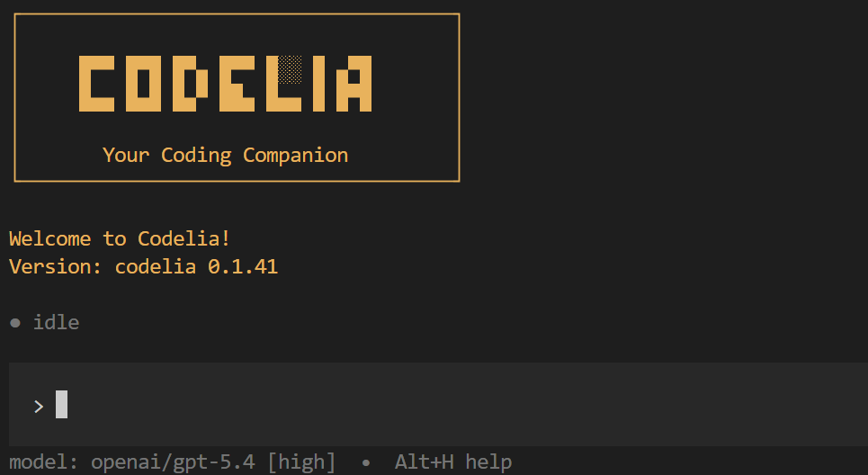

# Codelia



Codelia is a terminal-first coding agent with a native TUI.
It helps you inspect, edit, and reason about code directly in your repository.

The product ships through the `codelia` CLI, while the main interactive experience is the TUI.
Under the hood, a TypeScript runtime and a Rust TUI communicate over JSON-RPC.

⚠️ **Early Development / Alpha Stage** — Codelia is under active development and is not yet production-ready.

## Security note

Codelia does **not** currently provide a strong OS-level sandbox.
Its current safety model is mainly rule/policy-based, and commands such as `bash` still run on the host with the configured working directory.

If you need strong isolation, treat the current release as **not sufficient on its own**.
Worker/runtime sandbox hardening is still planned/in progress.

## Quickstart

Install the published CLI package globally:

```sh
npm install -g @codelia/cli
```

Update to the latest version:

```sh
npm update -g @codelia/cli@latest
```

Launch the TUI:

```sh
codelia
```

Chose a provider/model and set up auth.

Current provider support:
- `openai` (API Key or OAuth with ChatGPT Plus/Pro)
- `anthropic` (API Key only)
- `openrouter` (API Key only)

Planned / not wired as a runtime provider yet:
- `google` / Gemini

Then type a request such as:

```text
Find the failing test and explain the root cause.
```

## What you can do

- Work with a coding agent directly in your terminal
- Resume previous sessions with `--resume`
- Use slash commands such as `/help`, `/model`, `/skills`, and `/mcp`
- Add repo-specific instructions with `AGENTS.md`
- Package reusable workflows as Skills
- Connect external tool servers through MCP
- Run a one-shot non-interactive request with `codelia --prompt`

## TUI workflow

A typical session looks like this:

1. Start `codelia`
2. Type a request in the composer
3. Press `Enter` to send it
4. Watch inline progress, tool activity, and results in the terminal
5. Continue the same thread with follow-up prompts
6. Resume later with `codelia --resume`

Useful startup commands:

```sh
codelia
codelia --resume
codelia --resume <session_id>
codelia --initial-message "Review the latest changes"
codelia --diagnostics
```

## Docs

### User docs

- Start here: [`docs/getting-started.md`](docs/getting-started.md)
- TUI basics: [`docs/tui-basics.md`](docs/tui-basics.md)
- Themes: [`docs/themes.md`](docs/themes.md)
- CLI reference: [`docs/reference/cli.md`](docs/reference/cli.md)
- Config reference: [`docs/reference/config.md`](docs/reference/config.md)
- Environment variables: [`docs/reference/env-vars.md`](docs/reference/env-vars.md)
- AGENTS.md: [`docs/agents-md.md`](docs/agents-md.md)
- Skills: [`docs/skills.md`](docs/skills.md)
- MCP: [`docs/mcp.md`](docs/mcp.md)

### Developer / internal docs

- Docs index: [`dev-docs/README.md`](dev-docs/README.md)
- Architecture notes: [`dev-docs/typescript-architecture-spec.md`](dev-docs/typescript-architecture-spec.md)
- Specs: [`dev-docs/specs/`](dev-docs/specs/)
- npm publish runbook: [`dev-docs/npm-publish.md`](dev-docs/npm-publish.md)

## Local development

Requirements:
- [Bun](https://bun.sh/)
- Rust toolchain (`cargo`) for the TUI build/run path

Install dependencies:

```sh
bun install
```

Run the TUI directly from this repo:

```sh
bun run tui
```

Useful development commands:

| Command | Description |
|---|---|
| `bun run typecheck` | Type checking |
| `bun run test` | Run tests |
| `bun run fmt` | Format with Biome |
| `bun run check:deps` | Dependency hygiene |
| `bun run check:versions` | Workspace version sync |

## Repository layout

- `packages/runtime` — runtime process, tools, permissions, MCP
- `crates/tui` — Rust TUI client
- `packages/cli` — `codelia` CLI entrypoint
- `docs/` — user-facing documentation
- `dev-docs/` — developer/internal documentation

## Known limitations

- Permissions are policy-based and are not a full OS-level security boundary.
- `bash` runs on the host shell with the sandbox working directory; this is not complete isolation.
- Worker isolation hardening is still planned/in progress.
