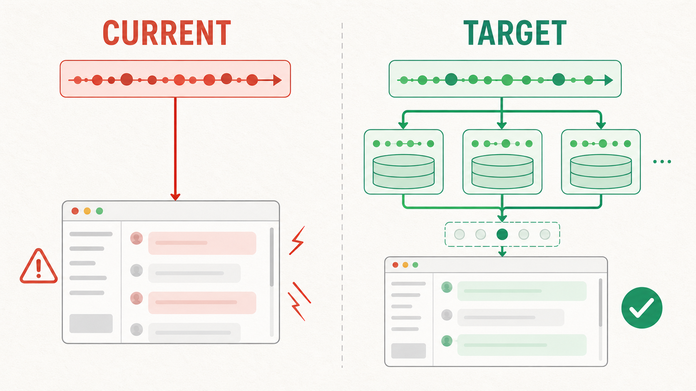
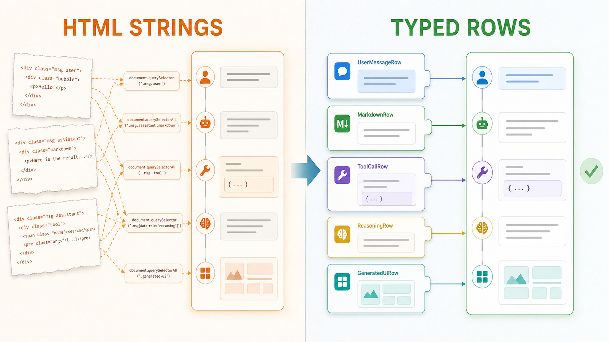
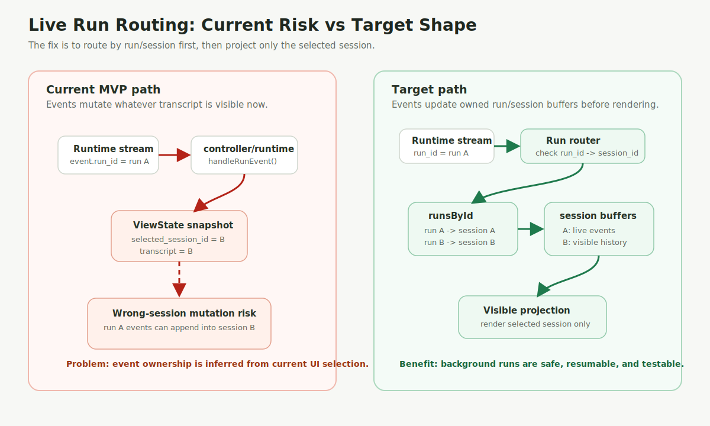
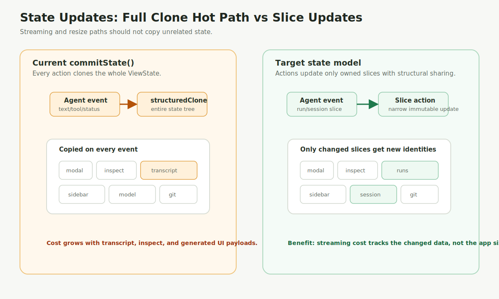
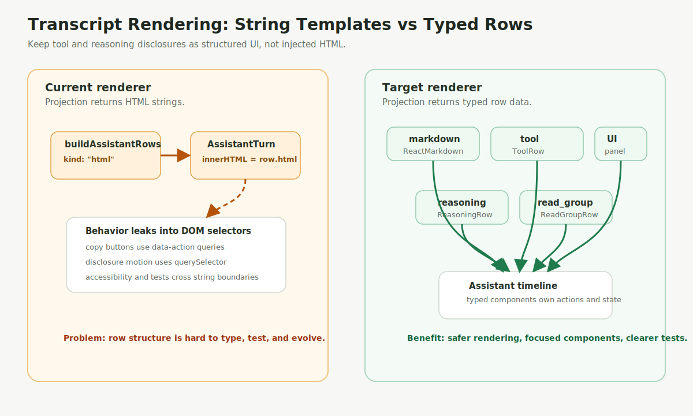
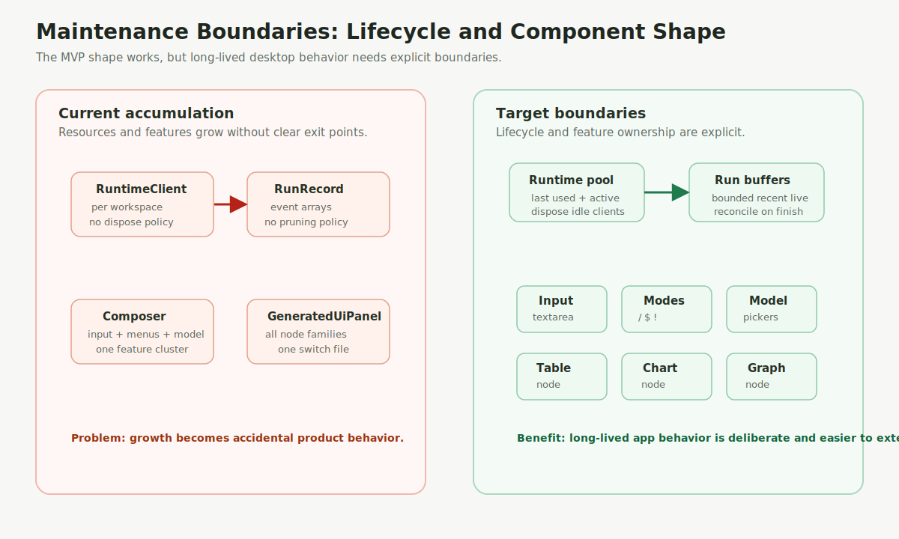

# Desktop GUI Architecture Review - 2026-04-25

This note records a focused review of the current Electrobun desktop GUI code.
It is a documentation artifact only; no production behavior changed as part of
this review.

## Summary

The desktop GUI is already moving in a healthy direction: the package has clear
`bun`, `server`, `shared`, and `mainview` layers; `mainview` has an explicit
`controller -> state -> hooks -> components` shape; and
`bun run check:architecture` enforces the most important import boundaries.

The main long-term risks are not basic layering violations. They are areas where
the current MVP implementation is still simpler than the product architecture in
`ui-architecture.md`:

- live runtime events are applied to the visible transcript instead of a
  run/session-keyed live buffer;
- every state commit clones the full desktop view state;
- transcript tool rows are generated as HTML strings and injected into React;
- runtime clients and run event buffers are retained without lifecycle policy;
- several GUI files are becoming feature clusters.

## Implementation Follow-up - 2026-04-26

The first hardening pass addressed the highest-risk parts of this review:

- mainview now keeps live run state in `ViewState.liveRuns` and projects only
  the selected session's live events into the visible transcript;
- stream events carry optional `session_id` and `workspace_path` routing
  metadata from the desktop service;
- `commitState()` now uses shallow structural sharing instead of a full
  `structuredClone()` of the entire view state;
- transcript tool/reasoning/note/read-group rows are typed React rows rather
  than string-built HTML rendered through `dangerouslySetInnerHTML`;
- `RuntimeClient` has explicit disposal, and `DesktopService` now has idle
  runtime eviction plus completed-run pruning;
- composer branch/model controls were split into focused subcomponents.
- generated UI chart and graph node families were split out of
  `GeneratedUiPanel`.

Remaining follow-up:

- Generated UI text/table/code node families still live in the panel file; split
  them if that renderer gains more variants or actions.
- More exhaustive integration tests should be added when background runs become
  a first-class visible workflow.

## Visual Overview

### Generated Overview Images

These raster overview images were created with the built-in `imagegen` workflow
for quick human scanning. The SVG diagrams below are the deterministic
source-friendly companion diagrams with exact labels.

### Live Run Routing

### State Update Cost

### Transcript Rendering

### Maintenance Boundaries

## Findings

### 1. Live run events are routed into the currently visible transcript

- Priority: P1
- Main file: `packages/desktop/src/mainview/controller/runtime.ts`
- Related files:
  - `packages/desktop/src/mainview/state/actions/runtime.ts`
  - `packages/desktop/src/mainview/state/actions/shared.ts`
  - `packages/desktop/src/server/service.ts`
  - `dev-docs/specs/desktop/ui-architecture.md`

Current behavior:

- `runEvent` messages are handled in the webview and applied directly to the
  current `ViewState`.
- `applyAgentRunEvent` appends assistant events to
  `snapshot.transcript`.
- `refreshCurrentSnapshot()` reloads the currently selected workspace/session
  after run completion.

Why this matters:

- The desktop spec requires `run_id` and `session_id` to remain separate.
- Session switching must not make a still-running run append into the wrong
  visible transcript.
- Returning to a running session should restore the live stream, not rely only
  on a cold history reload.

Preferred direction:

- Keep a webview-side live run registry such as:
  - `runsById[runId] -> { sessionId, workspacePath, status, eventBuffer }`
  - `sessionLiveState[sessionId] -> visible projection inputs`
  - `visibleSessionId`
- Apply incoming events to the run/session bucket first.
- Derive the visible transcript from the selected session plus its live buffer.
- Refresh hydrated history when a run finishes, but only reconcile the affected
  session.

Acceptance signals:

- A run can continue while another session is visible.
- Events for background runs do not mutate the visible transcript.
- Switching back to the running session shows accumulated live events.
- Unit tests cover event routing across two sessions and two runs.

### 2. Every state update clones the full desktop view state

- Priority: P2
- Main file: `packages/desktop/src/mainview/state/desktop-store.ts`
- Related files:
  - `packages/desktop/src/mainview/state/actions/*`
  - `packages/desktop/src/mainview/state/view-state.ts`

Current behavior:

- `commitState()` calls `structuredClone(getDesktopViewState())` for every
  state update.
- Streaming agent events, status updates, composer changes, and sidebar resize
  all use the same full-clone path.

Why this matters:

- Long transcripts, tool results, generated UI payloads, and inspect data can
  make `ViewState` large.
- Streaming paths can produce many small events. Full-tree copies on each event
  can create visible latency and memory pressure.
- Full cloning also makes it easy to accidentally treat the entire snapshot as
  one mutable blob instead of a set of independently owned slices.

Preferred direction:

- Move toward slice-oriented state actions with structural sharing.
- Keep hot streaming updates narrow: update only the affected transcript/run
  slice and status fields.
- Consider Immer or explicit immutable helper functions, but keep the action API
  explicit enough for architecture checks.
- Avoid storing large derived render products in state; derive them from stable
  inputs with memoized selectors where needed.

Acceptance signals:

- Streaming an assistant token or tool event does not clone unrelated inspect,
  workspace, or modal state.
- Sidebar resize updates do not copy transcript history.
- A regression test or small benchmark covers long transcript update cost.

### 3. Transcript tool rows are string-built HTML

- Priority: P2
- Main files:
  - `packages/desktop/src/mainview/controller/transcript.ts`
  - `packages/desktop/src/mainview/components/transcript/AssistantTurn.tsx`
  - `packages/desktop/src/mainview/components/transcript/TranscriptPane.tsx`

Current behavior:

- `buildAssistantRenderRows()` emits `kind: "html"` rows for tool, reasoning,
  permission, compaction, and grouped read disclosures.
- `AssistantTurn` renders those rows through `dangerouslySetInnerHTML`.
- Disclosure animation and copy behavior are driven by DOM selectors and event
  delegation in `TranscriptPane`.

Why this matters:

- Dynamic content is currently escaped, so this is not an immediate XSS finding.
- The approach still makes future row variants harder to test and reason about.
- Accessibility, keyboard behavior, copy actions, and disclosure state are
  spread across string templates and DOM queries.
- The spec says tool/reasoning disclosures should remain structured UI rows.

Preferred direction:

- Make `AssistantRenderRow` a typed React-facing union:
  - `markdown`
  - `tool`
  - `read_group`
  - `reasoning`
  - `permission_note`
  - `generated_ui`
- Render each row with React components instead of HTML strings.
- Keep disclosure open/closed state as desktop-local transient state when that
  state needs to survive re-rendering.
- Move copy actions and disclosure animation into row components or focused
  hooks.

Acceptance signals:

- `AssistantTurn` no longer needs `dangerouslySetInnerHTML`.
- Tool result copy behavior is tested through React rendering.
- Read grouping still preserves per-file inspectability.
- Markdown continues to render with raw HTML disabled.

### 4. Runtime clients and run event buffers are unbounded

- Priority: P2
- Main files:
  - `packages/desktop/src/server/service.ts`
  - `packages/desktop/src/server/runtime-client.ts`

Current behavior:

- `DesktopService` keeps one `RuntimeClient` per normalized workspace path.
- `RunRecord.events` accumulates stream events for each run.
- There is no explicit client disposal, idle timeout, max workspace policy, or
  run event pruning.

Why this matters:

- A long-lived desktop app may open many workspaces over a day.
- Runtime child processes and event buffers should have a lifecycle policy.
- Without an explicit policy, memory/process retention becomes accidental
  product behavior.

Preferred direction:

- Add `RuntimeClient.dispose()` to terminate the child process and reject/clear
  pending requests.
- Track last-used timestamps for runtime clients.
- Define an idle eviction policy for non-active workspaces.
- Prune completed run event buffers after they are reconciled into persisted
  session history, or keep only bounded recent buffers for resume UX.

Acceptance signals:

- Closing or evicting an idle workspace runtime is explicit and testable.
- Pending requests fail with a clear error when a runtime is disposed.
- Completed run buffers do not grow without bound.

### 5. Large GUI files are becoming feature clusters

- Priority: P3
- Main files:
  - `packages/desktop/src/mainview/components/shell/Composer.tsx`
  - `packages/desktop/src/mainview/components/GeneratedUiPanel.tsx`

Current behavior:

- `Composer` owns text input, slash suggestions, skill suggestions, branch
  picker, model picker, reasoning picker, fast-mode toggle, keyboard handling,
  and local menu state in one component.
- `GeneratedUiPanel` owns multiple unrelated generated UI node families in one
  file.

Why this matters:

- The files are still readable, but they are already feature clusters.
- Adding file attachments, richer branch operations, generated UI actions, or
  chart/diagram variants will make these components hard to change safely.

Preferred direction:

- Split `Composer` by sub-surface:
  - `ComposerInput`
  - `ComposerModeButtons`
  - `ComposerCommandSuggestions`
  - `ComposerSkillSuggestions`
  - `ComposerBranchPicker`
  - `ComposerModelControls`
- Split generated UI rendering by node family:
  - `generated-ui/GeneratedUiPanel.tsx`
  - `generated-ui/TextNodes.tsx`
  - `generated-ui/TableNode.tsx`
  - `generated-ui/ChartNodes.tsx`
  - `generated-ui/GraphNodes.tsx`
- Keep these as presentational components; state remains in App/hooks/controller
  boundaries according to `packages/desktop/AGENTS.md`.

Acceptance signals:

- The top-level composer component reads like assembly.
- New generated UI node types can be added without editing a 500-line switch
  file.
- Package architecture checks continue to pass.

## Recommended Work Order

1. Fix live run/session routing before adding more background-run or multi-panel
   behavior.
2. Replace full-state cloning on the streaming path.
3. Convert transcript disclosure rows from HTML strings to typed React rows.
4. Add lifecycle policy to server-side runtime clients and run buffers.
5. Split large GUI feature clusters opportunistically when touching those
   surfaces.

## Verification Performed

- `bun run check:architecture` from `packages/desktop`
- `bun run typecheck` from `packages/desktop`
- Manual source review of:
  - `packages/desktop/src/mainview/controller/runtime.ts`
  - `packages/desktop/src/mainview/state/desktop-store.ts`
  - `packages/desktop/src/mainview/controller/transcript.ts`
  - `packages/desktop/src/mainview/components/transcript/*`
  - `packages/desktop/src/mainview/components/shell/Composer.tsx`
  - `packages/desktop/src/mainview/components/GeneratedUiPanel.tsx`
  - `packages/desktop/src/server/service.ts`
  - `packages/desktop/src/server/runtime-client.ts`
