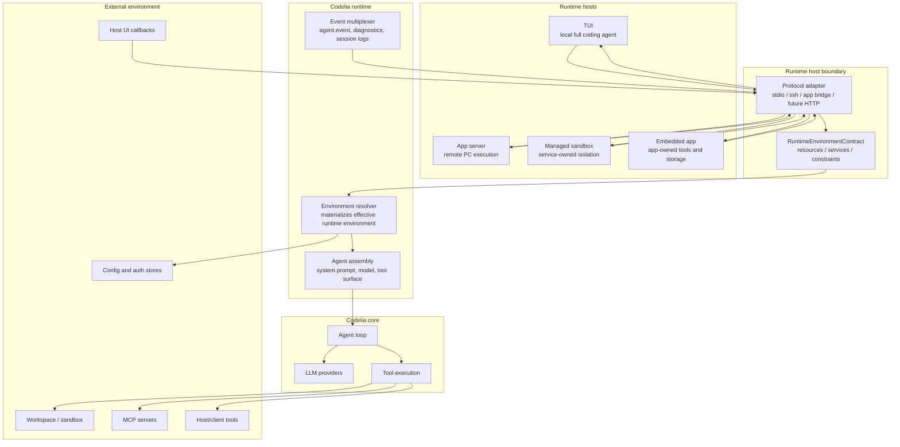
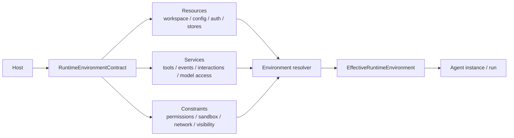
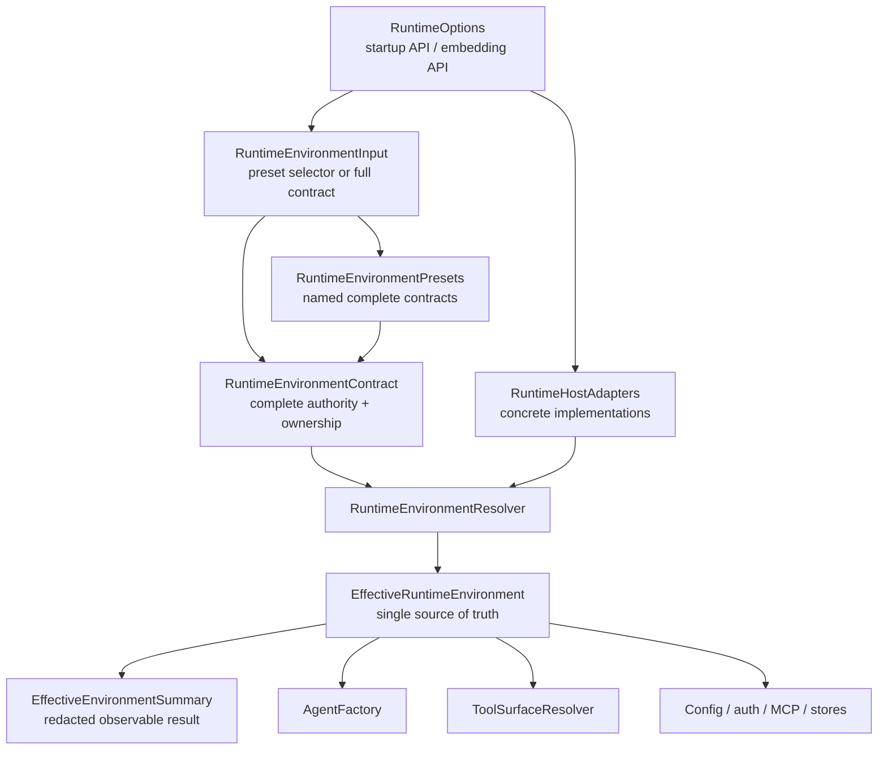
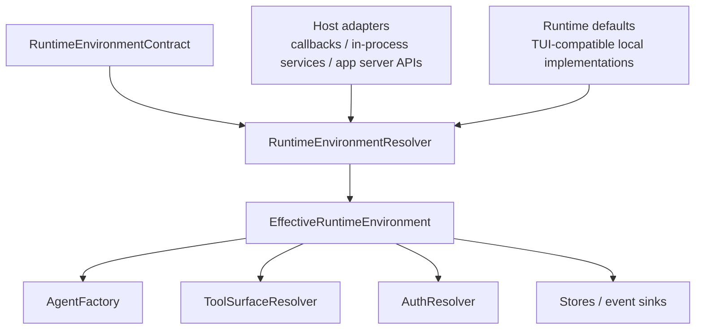
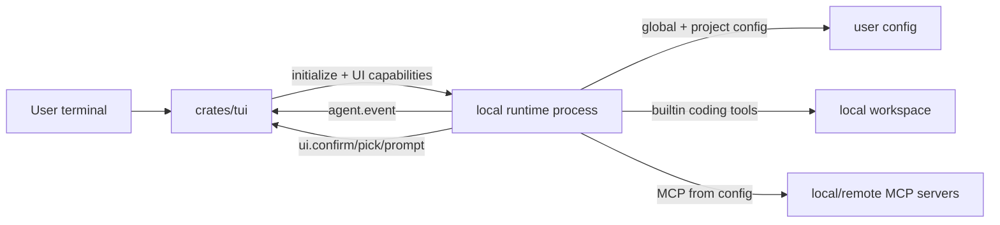
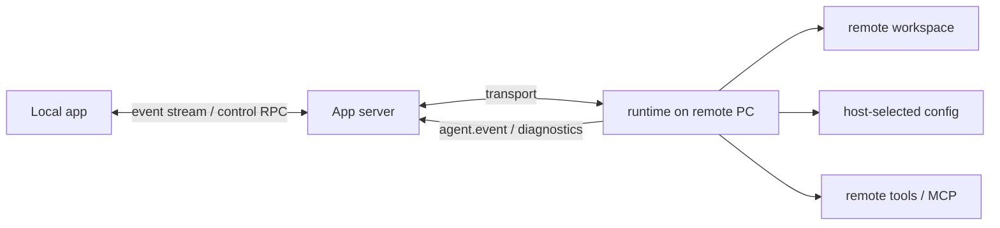
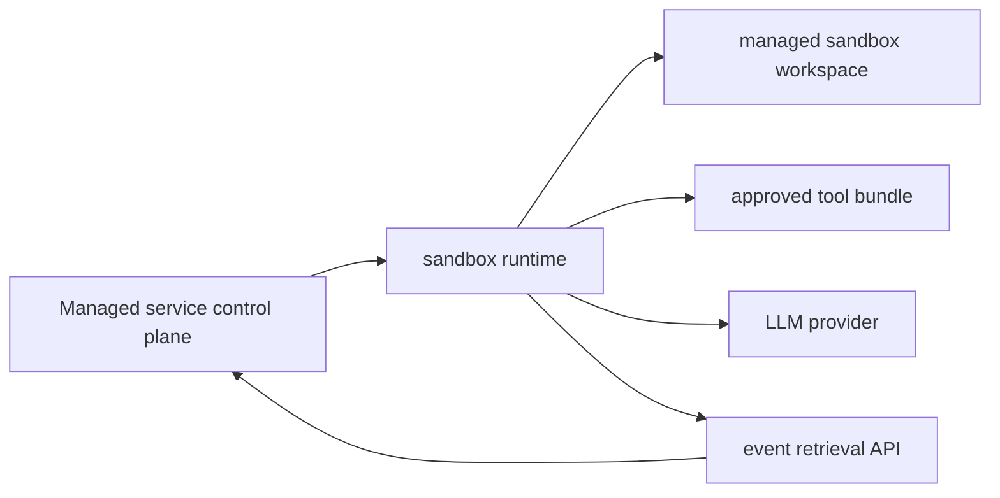
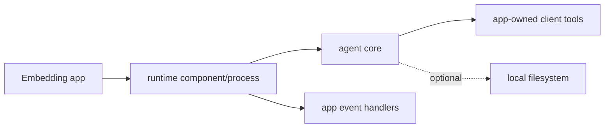

# Runtime Environment Contract

Status: MVP implemented (2026-06-22) with future axes still draft

This spec defines how `@codelia/runtime` should be shaped as an embeddable
agent execution substrate rather than only the backing process for the TUI.
The runtime should let each host decide how the agent interacts with its
environment: local files, remote machines, managed sandboxes, config stores,
MCP servers, UI prompts, and event streams.

The current TUI behavior remains a valid host preset. The implemented MVP stops
baking that full coding-agent preset into every startup path by resolving an
effective runtime environment before stores, tasks, MCP, context loading, auth,
and agent construction. Future app-server / managed-sandbox / richer embedded
axes in this spec are still design guidance until they have concrete bindings
and tests.

The contract is an authority and ownership contract. It should describe what the
runtime may access, who owns each environment interaction, how missing bindings
fail, and what is observable. It must not become a giant serialized dependency
injection object or a full runtime configuration DSL.

---

## 1. Goals

1. Make runtime usable from many hosts: TUI, desktop/app server, managed
   sandbox service, embedded app, benchmark runner, and future products.
2. Let the host explicitly control environment interaction:
   - workspace and sandbox roots
   - config and credential sources
   - model-visible tools
   - permission and approval behavior
   - UI/host callback responsibilities
   - event delivery and session persistence
3. Preserve current TUI behavior as a "full coding agent" preset.
4. Make runtime startup observable: hosts should know which config sources,
   workspace roots, tool surfaces, and event sinks were actually resolved.
5. Keep `@codelia/core` focused on agent loop / model / tool execution, with
   runtime owning host integration and environment resolution.
6. Separate the serializable authority contract from concrete host adapters and
   runtime implementation objects.

## 2. Non-Goals

1. Defining every concrete sandbox backend. See `sandbox-isolation.md`.
2. Replacing the existing UI protocol in one step. See `ui-protocol.md`.
3. Moving product/UI presentation settings such as TUI theme into the generic
   runtime environment contract. TUI theme remains a TUI-owned compatibility
   concern; future desktop/app hosts should own their own presentation settings.
4. Implementing multi-tenant security solely through permission rules.
5. Forcing one default answer for whether global config, MCP, or local file
   tools should be used. Those are runtime environment choices.
6. Freezing a full public protocol for stores, auth refresh, config writes,
   artifacts, or MCP configuration before one implementation proves the shape.

---

## 3. Architecture Overview

### 3.1 Host-owned environment contract

The runtime should be initialized with a host-owned environment contract. The
contract describes how this runtime instance is allowed to see and affect the
outside world.



### 3.2 Runtime environment, not policy bag

The top-level abstraction should be a runtime environment, not a policy bag.
Policy is one part of the environment: it constrains resources and services.
The environment is the thing runtime actually resolves and uses.



This framing avoids a trap: `host-store`, `mcp`, `confirm`, and `sandbox` are not
all the same kind of thing. Some are resources, some are services, and some are
constraints over those resources/services.

### 3.3 Contract, adapters, and effective environment

Do not expose one giant object and call it the runtime environment. The design
has distinct layers:



Conceptual layering:

| Layer | Purpose | Public protocol posture |
|---|---|---|
| `RuntimeOptions` | startup / in-process SDK entry point | SDK API |
| `RuntimeEnvironmentInput` | preset selector or explicit full contract | SDK API first |
| `RuntimeEnvironmentPreset` | named complete contract such as `tui-local` | public names can be stable |
| `RuntimeEnvironmentContract` | complete serializable authority and ownership contract | only partially public at first |
| `RuntimeHostAdapters` | concrete providers/callbacks/stores | in-process or host binding, not raw protocol schema |
| `EffectiveRuntimeEnvironment` | fully resolved internal truth | internal only |
| `EffectiveEnvironmentSummary` | redacted summary for inspection/debug/session metadata | expose early |

The contract should answer questions such as whether filesystem/process/network
access exists, who owns config/auth/stores/events, and what failure mode applies.
It should not carry concrete store instances, OAuth implementation details,
TUI-specific onboarding behavior, a complete MCP server schema, or every future
artifact/replay shape.

Important startup rule:

- Authority-sensitive work must not happen before the effective environment is
  known. Today `startRuntime` already resolves cwd, creates stores, creates a
  task manager, and starts MCP before `initialize`. Therefore the first
  implementation should accept environment options at runtime startup and make
  `initialize.environment` a later protocol-controlled path only after startup
  side effects can be delayed safely.

---

## 4. Design Discipline

The spec must not propose settings because they "seem useful". Every
environment component must answer these questions before becoming protocol/API:

1. **What kind of component is it?**
   - resource: data/state/runtime substrate, such as config, auth, workspace,
     run log, resume state, artifact store
   - service: callable behavior, such as tools, event sink, prompt/confirm,
     OAuth broker
   - constraint: rule over resources/services, such as tool visibility,
     permission mode, filesystem access, network access
2. **Who owns the implementation?**
   - runtime-owned: existing runtime implementation is used
   - host-owned: host must provide an implementation
   - disabled: unavailable by design
   - volatile: runtime may keep memory-only state, but no durable store exists
3. **How is the implementation injected?**
   - runtime default
   - explicit path/object
   - protocol callback
   - in-process adapter
   - external service chosen by the host
4. **What happens on failure?**
   - fail startup
   - omit capability/tool
   - deny the specific action
   - return a tool error
   - continue degraded and emit an event
5. **What is observable?**
   - redacted effective environment summary
   - run/session metadata
   - event or diagnostic records

If an item cannot answer these questions, it should stay out of the protocol and
remain an implementation detail or future design note.

### 4.1 Concrete starting shape

Avoid placeholder types that do not show what runtime will actually do. Start
with a small concrete shape for the first two presets, then grow only when a real
host needs a new behavior branch.

This is the implemented MVP internal API shape, not a frozen public protocol
schema. Omitting `RuntimeOptions.environment` is equivalent to the compatibility
`tui-local` preset. Non-TUI hosts can pass a full contract plus adapters through
`startRuntime(options)` or in-process handler construction.

Keep two levels separate:

1. **MVP fields** are fields the first implementation should actually use to
   preserve `tui-local` and prove `embedded-no-local-tools`.
2. **Future axes** are fields that help reason about app-server, managed
   sandbox, or richer embedded hosts, but should not become API until a real
   implementation needs them.

MVP fields:

```ts
type RuntimeOptions = {
  // Declarative authority. This part should be serializable eventually. Omitted
  // means the compatibility preset, not an empty/ambient environment.
  environment?: RuntimeEnvironmentInput;

  // Concrete implementations for host-owned services. This is SDK/in-process
  // shape first; protocol hosts can bind these through callbacks later.
  adapters?: RuntimeHostAdapters;
};

type RuntimeEnvironmentPreset = "tui-local" | "embedded-no-local-tools";

type RuntimeEnvironmentInput =
  | { preset: RuntimeEnvironmentPreset }
  | { contract: RuntimeEnvironmentContract };

type RuntimeEnvironmentContract = {
  workspace: {
    root?: string;
    filesystem: "enabled" | "disabled";
    process: "runtime" | "disabled";
  };

  context: {
    systemPrompt: "runtime-default" | "host";
    projectInstructions: "from-workspace" | "disabled";
    skills: "from-config" | "disabled";
    executionEnvironment: "from-config" | "disabled";
  };

  auth: {
    model: "runtime-default" | "host";
  };

  config: {
    source: "runtime-default" | "host" | "disabled";
  };

  tools: {
    builtin: "full-coding-agent" | "none";
    search: "from-config" | "disabled";
    mcp: "from-config" | "disabled";
    host: "enabled" | "disabled";
  };

  persistence: {
    mode: "runtime" | "volatile";
  };

  events: {
    live: "json-rpc" | "host";
  };
};

const runtimeEnvironmentPresets: Record<
  RuntimeEnvironmentPreset,
  RuntimeEnvironmentContract
> = {
  "tui-local": {
    workspace: {
      filesystem: "enabled",
      process: "runtime",
    },
    context: {
      systemPrompt: "runtime-default",
      projectInstructions: "from-workspace",
      skills: "from-config",
      executionEnvironment: "from-config",
    },
    auth: { model: "runtime-default" },
    config: { source: "runtime-default" },
    tools: {
      builtin: "full-coding-agent",
      search: "from-config",
      mcp: "from-config",
      host: "disabled",
    },
    persistence: { mode: "runtime" },
    events: { live: "json-rpc" },
  },
  "embedded-no-local-tools": {
    workspace: {
      filesystem: "disabled",
      process: "disabled",
    },
    context: {
      systemPrompt: "host",
      projectInstructions: "disabled",
      skills: "disabled",
      executionEnvironment: "disabled",
    },
    auth: { model: "host" },
    config: { source: "host" },
    tools: {
      builtin: "none",
      search: "disabled",
      mcp: "disabled",
      host: "enabled",
    },
    persistence: { mode: "volatile" },
    events: { live: "host" },
  },
};

type RuntimeHostAdapters = {
  systemPromptProvider?: SystemPromptProvider;
  configProvider?: ConfigProvider;
  credentialProvider?: CredentialProvider;
  approvalService?: ApprovalService;
  promptService?: PromptService;
  eventSink?: RuntimeEventSink;
  stores?: RuntimeStores;
  toolProviders?: ToolProvider[];
};
```

Implemented MVP locations:

- `packages/runtime/src/environment.ts` owns presets, validation, adapter types,
  and the redacted effective summary.
- `packages/runtime/src/environment-services.ts` routes model/config/auth/system
  prompt reads and writes through runtime-default or host-owned providers.
- `packages/runtime/src/volatile-stores.ts` provides memory-only session,
  event, and tool-output stores for the no-local proof preset.
- `packages/runtime/src/runtime.ts` resolves the effective environment before
  creating stores, task manager, AGENTS resolver, or MCP manager.
- `packages/runtime/src/agent-factory.ts` gates builtin/search/MCP/host tools,
  prompt context, config, auth, model metadata cache use, and local sandbox
  creation from the effective environment.
- `packages/runtime/src/rpc/handlers.ts` gates operator RPC capabilities
  (`shell.*`, `task.*`, `mcp.list`, `skills.list`, `theme.set`) and disables
  TUI-only startup onboarding for non-TUI presets.
- `packages/runtime/src/rpc/context.ts` exposes the summary via
  `context.inspect`; `packages/runtime/src/rpc/run.ts` stores it in session
  header metadata.

`tools.search` is separate from `tools.builtin` because current runtime search is
already a config-driven/provider-driven surface: it can become provider-hosted
search definitions or a local `search` tool. `embedded-no-local-tools` should
therefore disable runtime-owned search unless the host supplies search as a host
tool provider.

`tools.mcp` is an MVP axis, not a later refinement, because current runtime
starts MCP from merged config before protocol `initialize`. A non-local preset
must be able to disable MCP startup and OAuth flows before they happen.

`context` is separate from `tools` because current agent construction reads and
injects prompt-side local context before the model sees any tools: the system
prompt file, AGENTS/project instructions, skills catalog, and execution
environment block. Removing model-visible file/process tools is not enough for
`embedded-no-local-tools`; these context readers must also be gated.

Expected calls:

```ts
import {
  startRuntime,
  type RuntimeHostAdapters,
} from "@codelia/runtime/sdk";

await startRuntime({
  environment: { preset: "tui-local" },
});

const adapters: RuntimeHostAdapters = {
  systemPromptProvider,
  configProvider,
  credentialProvider,
  eventSink,
  toolProviders: [appTools],
};

await startRuntime({
  environment: { preset: "embedded-no-local-tools" },
  adapters,
});
```

The package root remains the auto-starting stdio runtime used by the TUI and
CLI launchers. In-process hosts must use the side-effect-free
`@codelia/runtime/sdk` subpath so importing the SDK does not start a stdio
server. `startRuntime(options)` resolves after startup wiring is complete and
rejects when environment validation or startup fails.

Do not add "preset plus partial overrides" to the MVP shape. If a host needs a
variant that differs from a preset, it should pass a full `contract` so there is
no hidden merge policy. A convenience builder can be added later without making
partial preset overrides part of the runtime contract.

The effective environment is not a second public config object. It is the
runtime's resolved truth after preset expansion, adapters, and validation:

```ts
type EffectiveRuntimeEnvironment = RuntimeEnvironmentContract & {
  sourcePreset?: RuntimeEnvironmentPreset;
  resolvedTools: {
    modelVisible: string[];
    operatorOnly: string[];
    disabled: string[];
  };
  summary: EffectiveEnvironmentSummary;
};
```

Future candidate axes, not MVP API:

| Axis | Example values | Add only when |
|---|---|---|
| filesystem access mode | `read-write`, `read-only`, host-backed filesystem | a host needs read-only or host-mediated file access |
| network policy | `inherit`, disabled, allowlist, host-controlled | runtime can enforce or delegate network behavior |
| search backend | provider-native search, local DDG/Brave search, host search | search needs behavior beyond current config-driven runtime default |
| MCP ownership detail | host-provided MCP registry, lazy MCP, per-server disable | behavior beyond config-driven/disabled MCP is needed |
| prompt context detail | host docs, host skills, custom project instruction strategy | the coarse MVP context gates are not enough |
| approval owner | TUI, host, disabled-deny, future auto-approval | approval is decoupled from TUI-specific UI requests |
| prompt / secret input | TUI, host, disabled, secret prompt | generic interaction service exists |
| persistence detail | run log, resume state, tool cache, artifact store, task registry | these stores can be independently injected/tested |
| event replay | runtime, host, volatile, disabled, poll/SSE | non-TUI event retrieval is implemented |
| config write owner | runtime, host, disabled | host-mediated config writes are implemented |
| MCP credentials | runtime-default, host, disabled | MCP auth is separated from model auth |

Rules for adding fields:

- `preset` is a host convenience, not a runtime product identity. The TUI maps
  to today's full local coding-agent behavior.
- Provider/interface conformance is the primary implementation contract. Add an
  enum only when runtime actually branches on it.
- Avoid generic `capabilities: string[]` bags. If capability matters to runtime,
  express it through a provider method/interface or a field with a concrete
  caller.
- Host-owned contract values require the matching adapter or protocol binding.
  Runtime must not silently fall back to local files, local storage, or ambient
  config.
- Volatile is only valid for stateful resources where in-memory state is
  meaningful. It is not valid for services such as prompt/confirm.



### 4.2 Validation rules

1. Host-owned components require host implementations.
2. Runtime-owned defaults are allowed only when the selected environment preset
   opts into them.
3. Missing host-owned components fail closed.
4. Read and write ownership are separate for config, auth, persistence, and
   artifacts.
5. Model-visible tools and operator/control tools are separate services.
6. Any component that can affect model reasoning or tool execution must appear
   in the effective environment summary.
7. Secret values never appear in summaries, events, session headers, or
   diagnostics.
8. Downstream runtime code should read `EffectiveRuntimeEnvironment`, not
   scattered startup options, process env, config files, or UI capabilities.
9. Runtime internal authority, model-visible tool authority, operator/control
   authority, and host service authority are separate. A resource may be
   available to runtime internals without being visible to the model.
10. Event delivery, replay, resume, artifact retrieval, and audit are separate
    capabilities. Observability must not be used as a vague bucket for durable
    persistence.
11. Startup-time environment resolution wins over protocol-time environment
    hints. Protocol `initialize` may negotiate or refine only after the runtime
    can avoid authority-sensitive startup side effects.
12. Prefer one provider interface over many enum branches. Add a discriminator
    only when two implementations require different runtime behavior that cannot
    be expressed by the provider interface.
13. Keep MVP branches coarse: local filesystem, process execution, network,
    MCP, config/auth ownership, persistence mode, tool visibility, and approval
    availability. Do not model backend details such as keychain vs JSON file as
    protocol-level enum variants unless runtime must branch on them.

---

## 5. Environment Components

This section is intentionally a component analysis rather than final protocol
typing. The goal is to prevent under-designed flags.

### 5.1 Workspace

Kind: resource plus constraints.

Current runtime-owned implementation:

- `CODELIA_SANDBOX_ROOT` / cwd
- logical sandbox path guard
- runtime file tools
- runtime shell/task execution

Host-controlled questions:

| Question | Required answer |
|---|---|
| Filesystem access | read-write, read-only, host-backed, or disabled |
| Process execution | runtime shell, host process service, or disabled |
| Isolation | logical, runtime sandbox backend, or host-provided sandbox |
| Network | inherit, disabled, allowlist, or host-controlled |
| Failure | omit tools, deny calls, or fail startup |

Important consequence:

- If filesystem access is disabled, model-visible local file tools must not be
  exposed.
- If process execution is disabled, `shell` and shell follow-up tools must not
  be exposed to either model or generic operator tool calls.
- Approval mode does not imply network or OS isolation.

### 5.2 Config

Kind: resource.

Current runtime-owned implementation:

- global config from `CODELIA_CONFIG_PATH` or default storage path
- project config from `<workingDir>/.codelia/config.json`
- config write policy for model/theme/permissions

Host-controlled questions:

| Question | Required answer |
|---|---|
| Read source | runtime default, explicit path, host object/provider, or disabled |
| Read groups | model, permissions, mcp, skills, search, tui, execution_environment |
| Write owner | runtime file write, host-mediated write, or disabled |
| Cache/invalidation | startup-only, per-run refresh, or host invalidation event |
| Failure | fail startup, ignore optional layer, or use preset default |

Important consequence:

- Reading a config source must not imply write permission to that source.
- Host-provided config needs an implementation provider, not just a flag.
- Effective summaries should include source ids, scopes, groups, and write
  ownership, not raw config values.

### 5.3 Auth And Credentials

Kind: resource plus service.

Current runtime-owned implementation:

- env var fallback
- `auth.json`
- OpenAI OAuth / device-code / manual SSH flow
- MCP OAuth token store

Host-controlled questions:

| Question | Required answer |
|---|---|
| Credential source | runtime env/storage, host credential provider, injected token, or disabled |
| Credential scope | model provider, MCP server, or other service |
| Refresh owner | runtime refresh, host refresh, or no refresh |
| OAuth owner | runtime flow, host OAuth broker, or disabled |
| Credential writes | runtime auth store, host secret store, or disabled |

Important consequence:

- Model credentials and MCP credentials must be separable.
- Host-provided short-lived credentials require an explicit refresh path or
  explicit expiry failure behavior.
- Runtime events and summaries must only contain provider/source labels, never
  credential values.
- Secure stores such as macOS Keychain, Windows Credential Manager, or libsecret
  are credential-provider implementations, not generic environment contract
  primitives, unless runtime needs a distinct behavior branch for them.

### 5.4 Tools

Kind: service plus visibility constraint.

Current runtime-owned implementation:

- builtin coding tools
- local search tool / provider-hosted search definitions
- MCP tools from config
- per-run client tools via `run.start.tools`
- direct operator `tool.call`

Host-controlled questions:

| Question | Required answer |
|---|---|
| Model-visible tools | builtin groups, MCP, search, skills, client, host tools |
| Operator/control tools | tools callable by host UI/control plane, separate from model |
| Execution implementation | runtime builtin, MCP adapter, client.tool.call, host tool service |
| Tool dependencies | workspace, auth, persistence, network, interaction requirements |
| Failure | omit tool, fail startup, or return tool error |

Important consequence:

- Tool visibility is not the same as permission. A tool that should not be
  considered by the model should not be in the model-visible tool list.
- Tool groups need explicit dependency rules. Example: exposing `shell` may also
  need `shell_status`, `shell_logs`, `shell_wait`, `shell_result`, and
  `shell_cancel`.
- MCP lifecycle should follow tool environment resolution. Disabling MCP should
  prevent connection and OAuth attempts.

### 5.5 Permissions And Approval

Kind: constraint plus interaction service.

Current runtime-owned implementation:

- approval modes: `minimal`, `trusted`, `full-access`
- system/user allow/deny rules
- UI confirmation through runtime-to-UI requests
- remember writes into project config

Host-controlled questions:

| Question | Required answer |
|---|---|
| Permission mode | minimal, trusted, full-access, delegated, or future mode |
| Confirmation owner | runtime UI, host callback, disabled-deny, or explicit unattended allow |
| Remember owner | runtime config write, host-mediated write, or disabled |
| Deny behavior | tool error, run error, or host-visible approval event |
| Audit | which approval decisions are recorded |

Important consequence:

- Confirmation is not just a boolean capability. It is an interaction service
  with timeout, cancellation, replay, and audit semantics.
- If confirmation is unavailable, the safe default is deny unless the
  environment explicitly chooses an unattended allow mode.
- Permission policy does not replace sandbox isolation.
- Future auto-approval should be modeled as an approval-service behavior with
  audit, not as a synonym for `full-access`. Keep it out of the MVP unless a
  concrete policy engine exists.

### 5.6 Interaction Requests

Kind: service.

Current runtime-owned implementation:

- `ui.confirm.request`
- `ui.prompt.request`
- `ui.pick.request`
- `client.tool.call`
- planned local-resource brokers such as clipboard read

Host-controlled questions:

| Question | Required answer |
|---|---|
| Request type | confirm, prompt, pick, client tool, local resource |
| Owner | runtime UI protocol, host callback, or disabled |
| Timeout/cancel | timeout duration and cancellation behavior |
| Requiredness | required for run correctness or optional display helper |
| Failure | deny action, return tool error, or continue without helper |

Important consequence:

- Runtime must not assume a TUI exists.
- Remote runtime can access local resources only through explicit host-provided
  interaction services.
- Future secret input should be an interaction request with redaction/no-log
  semantics. It should not leak into generic prompt text, session records, or
  environment summaries.

### 5.7 Events And Persistence

Kind: service plus resources.

Current runtime-owned implementation:

- live JSON-RPC `agent.event`, `run.status`, `run.context`, diagnostics
- run JSONL store
- resume state store
- tool output cache
- task/lane registries

These are separate concerns:

| Concern | Kind | Examples |
|---|---|---|
| Live event delivery | service | JSON-RPC notifications, SSE, host callback |
| Run log | resource | append-only session records |
| Resume state | resource | compacted/restored model history |
| Tool output cache | resource | large output refs |
| Artifacts | resource | files, patches, images, reports |
| Task registry | resource | background shell/subagent/lane state |

Host-controlled questions:

| Question | Required answer |
|---|---|
| Delivery | runtime JSON-RPC, host push, host pull/SSE, or disabled |
| Storage owner | runtime store, host store, or volatile |
| Reference shape | local path, host artifact id, cache id, or no durable ref |
| Replay support | supported, best-effort, or unavailable |
| Failure | fail run, drop optional event, or continue with warning |

Important consequence:

- `volatile` means in-memory only for the current process/run. It is not the
  same as disabled.
- Host-owned stores need implementations that return stable references when
  later reads are expected.
- Event delivery is not persistence. A host can receive live events and still
  choose volatile resume state, or persist run logs without enabling replay.

### 5.8 Cross-cutting Axes

These axes should be represented in the effective environment before they become
large public protocol surfaces:

| Axis | Design question |
|---|---|
| Runtime vs agent authority | What may runtime internals access, and what may the model invoke? |
| Cancellation | How are model calls, tool calls, MCP calls, shell tasks, approval prompts, and persistence flushes cancelled? |
| Concurrency | How many runs, tool calls, shell tasks, event consumers, and config writes can run at once? |
| Task lifecycle | What is the relation between session, run, task, tool call, and artifact? |
| Network | Which network paths are allowed: model provider, runtime egress, tool egress, MCP, auth, artifact upload? |
| Artifact references | Are outputs local paths, cache ids, host artifact ids, URLs, or opaque refs? What are their lifetime and access rules? |
| Resume compatibility | Can a session created under one environment resume under another? Which environment fingerprint changes are blocking? |
| Credential refresh | Who owns initial credentials, refresh, OAuth prompts, expiry handling, and credential writes? |
| Audit | Which decisions/actions are recorded: approvals, denials, credential use, tool invocation, host overrides? |
| Transport boundary | Is a service in-process, protocol callback, external service, runtime default, or disabled? |

Minimum resume rule:

- Saved session metadata should eventually include an environment fingerprint:
  preset, workspace mode, filesystem/process/network modes, model-visible tool
  surface hash, MCP surface hash when present, prompt-environment hash, and
  persistence mode. Runtime should not silently resume a session when the new
  effective environment invalidates prior tool/prompt assumptions.

Minimum audit rule:

- Approval is not security and does not replace sandbox isolation. Managed and
  app-server hosts also need audit records describing who allowed or denied an
  action, under which policy, with redacted details.

---

## 6. Target Host Presets

Presets are host-side conveniences. Runtime should implement the underlying
environment resolution rather than hard-code product-specific behavior.

### 6.1 TUI: full local coding agent



Environment shape:

- resources: local workspace, runtime default user config, cwd project config,
  runtime auth store/env, runtime session/resume/tool-output stores
- services: builtin coding tools, MCP/search/skills from config, per-run TUI
  client tools, JSON-RPC live events, runtime UI prompts/confirms/picks
- constraints: current approval mode, logical sandbox path guard, model-visible
  full coding-agent tool surface

### 6.2 App server: remote PC runtime with local event handling



Environment shape:

- resources: remote workspace, host-selected config/auth resources, optional
  runtime or host persistence resources
- services: runtime tools execute on the remote machine, events stream to the
  app server, local resources only through explicit app-server callbacks
- constraints: shell/file/MCP/search visibility follows the app-server selected
  environment, not the local app UI environment

### 6.3 Managed sandbox agent



Environment shape:

- resources: host-provided sandbox workspace, injected or host-mediated config
  and auth, host or volatile persistence
- services: approved tool bundle, event retrieval API (`sse`, `poll`, or host
  callback), optional host-mediated approval
- constraints: sandbox-owned filesystem/process/network limits, service-owned
  tool visibility, no implicit TUI prompts

### 6.4 Embedded app runtime



Environment shape:

- resources: app-selected workspace/config/auth/store resources, or none when
  the app wants a tool-call-only agent
- services: app-owned client tools, app event handlers, optional runtime builtin
  tools
- constraints: the embedding app decides whether local file/process tools exist
  at all; runtime should be usable without TUI, shell tools, or Codelia-specific
  UI panels

### 6.5 MVP preset: embedded no-local-tools

This preset is the smallest useful proof that runtime authority is actually
host-controlled.

Environment shape:

- resources: no runtime-owned local filesystem tools, no runtime-owned process
  execution, no implicit project config read, no MCP startup by default
- services: host/client tools only, explicit model credential source, optional
  volatile runtime state, optional host event sink
- constraints: approval unavailable means deny, no hidden fallback to TUI prompts
  or ambient global/project config writes
- observability: `context.inspect` reports no local filesystem, no process, no
  MCP, volatile or host-owned persistence, and the exact model-visible tool
  surface

Invariant:

- Given this preset, `read`, `write`, `edit`, `apply_patch`, `view_image`,
  `shell`, shell follow-up tools, process-backed MCP servers, local AGENTS/skills
  loading, and project `.codelia/config.json` reads must be absent unless the
  host explicitly re-enables the required resource/service.

---

## 7. Current Design Problems And MVP Status

The following were issues in the pre-MVP runtime shape, not necessarily bugs in
the TUI product. The MVP addresses the coarse authority boundaries while leaving
some finer-grained store/event/replay/auth details for later phases.

1. Runtime startup constructs a TUI-style local coding environment by default:
   local cwd, global/project config, MCP startup, skills, search, and coding
   tools are currently coupled.
   `startRuntime` performs authority-sensitive work before any protocol
   `initialize` request can carry a host environment.
2. Config layer discovery is runtime-owned and ambient. Hosts cannot yet define
   config resources with separate read/write ownership per layer/group.
3. Model-visible tool surface and host/operator RPC tools are not clearly
   separated.
4. MCP lifecycle starts from runtime startup/config rather than the effective
   tool environment.
5. `initialize` mixes protocol negotiation, TUI-owned theme resolution,
   onboarding, and capability setup.
6. Runtime events do not yet include a complete effective environment summary.
7. Per-run client tools can extend the surface, but hosts cannot yet define the
   base runtime surface declaratively.
8. System-prompt context, AGENTS loading, skills loading, config reads, and
   session stores can perform local reads/writes even if the eventual model tool
   surface is restricted.

### 7.1 Current implementation audit

This audit reflects the MVP implementation as of 2026-06-22 and is meant to
prevent the spec from treating future axes as already-implemented behavior.

| Area | Current implementation | Compatibility implication |
|---|---|---|
| Runtime startup | `startRuntime(options?)` resolves `RuntimeOptions` first. Omitted options expand to `tui-local`. Stores, task manager, AGENTS resolver, and MCP manager are created only after environment resolution and are gated by it. The side-effect-free `@codelia/runtime/sdk` subpath exports configurable startup and host adapter types; the package root remains the auto-starting stdio entrypoint. | Current TUI launch remains compatible because it supplies no environment and receives the compatibility preset. In-process hosts can await startup and observe validation/startup failures. `initialize.environment` remains future work because startup-side authority must be known earlier. |
| TUI launch | TUI still spawns runtime and sends UI capabilities through `initialize`; it does not need to send an environment yet. Per-run TUI client tools remain `run.start.tools`. | TUI behavior is intentionally preserved. Later TUI can send `{ preset: "tui-local" }` without semantic change. |
| Config | `tui-local` uses existing global/project config merge and write targets. Host config providers can serve model, permissions, search, skills, execution-environment, and TUI theme reads, plus model/theme/permission writes. | Non-local presets fail closed when host config is required but missing. Full MCP config ownership and finer read/write grouping remain future work. |
| Theme | `initialize` still returns `InitializeResult.tui.theme` only when the effective environment is TUI-compatible and config is available. `theme.set` is disabled outside the TUI-local environment. | Theme remains a legacy TUI compatibility shim, not generic runtime environment. |
| Auth | `tui-local` keeps env/API-key/auth-store/OAuth behavior. Host model auth uses `credentialProvider`; non-local presets can avoid local model auth reads. MCP auth remains runtime-owned only when MCP is enabled. | Keychain/credential-manager support belongs behind credential providers unless runtime needs a distinct behavior branch. |
| Tool surface | Agent tools are gated by `tools.builtin`, `tools.search`, `tools.mcp`, and `tools.host`. Host tools are loaded from `toolProviders`. Per-run client tools remain request-scoped. | Disabling builtins no longer implicitly leaves search/MCP/context enabled in the proof preset. Host/operator tool separation is coarse but functional. |
| Prompt context | System prompt can be runtime-default or host-provided. AGENTS/project instructions, skills catalog, and execution-environment context are individually gated. | `embedded-no-local-tools` does not read local AGENTS/skills or run execution-environment checks. |
| Persistence | `persistence.mode="runtime"` keeps existing stores. `persistence.mode="volatile"` uses in-memory session/run-event/tool-output stores and avoids model metadata cache fetch/write during agent construction and static model listing. When no workspace identity exists, default `session.list` does not invent a local-cwd scope, so workspace-less volatile sessions remain visible. | Fine-grained run-log/resume/tool-cache/artifact/task-store ownership is future work. |
| Events | Live notifications can go to stdio JSON-RPC (`json-rpc`) or a host `eventSink` (`host`). Async host sink calls are serialized per runtime state; a rejected delivery is logged and does not block subsequent notifications. Session headers include the redacted environment summary. `session.history` reads local JSONL only when runtime persistence is enabled; host replay delivery is awaited before the history response, while volatile persistence returns no replay events. | Host callback event delivery is implemented with ordering across normal run notifications. Poll/SSE/host-owned replay APIs are planned, not implemented. |
| Operator RPC | `shell.*`, `task.*`, `mcp.list`, `skills.list`, and `theme.set` are gated by the effective environment and reflected in `initialize.server_capabilities`. `tool.call` can invoke host tools. | TUI capabilities remain true under `tui-local`; non-local presets fail closed or return empty results as appropriate. |

---

## 8. Implementation Direction And Status

### Phase 1: Internal effective environment, no behavior change

Status: implemented for the MVP.

1. Add `resolveRuntimeEnvironment(...)`, `EffectiveRuntimeEnvironment`, and a
   redacted `EffectiveEnvironmentSummary`.
2. Wire `startRuntime` and agent construction through the effective environment,
   with default `preset="tui-local"` preserving current behavior.
3. Add runtime metadata fields for:
   - workspace/cwd/sandbox
   - config source summary
   - prompt context summary
   - tool surface summary
   - MCP lifecycle summary
   - approval mode / confirmation capability
   - event persistence/stream mode
4. Expose the summary through `context.inspect`, session headers, and runtime
   debug logs.
5. Keep existing TUI behavior unchanged.

### Phase 2: Startup contract and TUI preset

Status: implemented for the in-process/startup API; protocol
`initialize.environment` remains future work.

1. Extend startup options / embedding API with `RuntimeEnvironmentInput`,
   `RuntimeEnvironmentContract`, and `RuntimeHostAdapters`.
2. Add a `tui-local` preset that maps to current behavior.
3. Add tests proving absent environment input preserves existing TUI-compatible
   defaults until TUI starts sending the explicit preset.
4. Make environment resolution a single module used by config, agent factory,
   MCP manager, auth resolver, and permission service.
5. Treat protocol `initialize.environment` as later work unless startup can
   defer authority-sensitive side effects safely.

### Phase 3: Split model tools from operator tools

Status: partially implemented with coarse environment gates. A dedicated
`ToolSurfaceResolver` remains future work.

1. Introduce a `ToolSurfaceResolver`.
2. Resolve model-visible builtin/MCP/search/skills/client tools from the
   effective tool service and visibility constraints.
3. Resolve host/operator RPC tools separately for `tool.call`, lane panels,
   commands, or app-server control actions.
4. Make `mcp.start` lazy and environment-gated.

### Phase 4: Prove no-local-tools authority

Status: implemented for the MVP proof preset, with focused tests covering
resolver validation, capability gating, host event sink, host tools, and session
header summary.

1. Add `embedded-no-local-tools` as the first non-TUI preset.
2. Gate builtin file/process tools, MCP, local search, and prompt-context
   loading from the effective environment.
3. Ensure disabled filesystem/process/MCP means model tools and operator RPCs
   are absent or denied before side effects, not merely approval-denied after
   startup.
4. Add invariants proving no hidden local AGENTS/skills/config/session access
   unless the effective environment explicitly allows it.

### Phase 5: Add non-TUI event retrieval modes

Status: partially implemented for host callback delivery only. Runtime JSONL
history replay remains available in the TUI/runtime-persistence path. Volatile
presets return no replay events rather than reading local storage. Poll/SSE and
host-owned replay APIs are future work.

1. Keep JSON-RPC notifications for TUI/local transports.
2. Add event sink abstraction usable by app server and managed sandbox
   deployments.
3. Support at least one API-first retrieval shape (`sse` or `poll`) without
   requiring TUI prompt/pick/confirm support.
4. Prefer a small polling API over SSE first if it proves the event-log/replay
   boundary with less transport machinery.

### Phase 6: Host-mediated writes and auth

Status: partially implemented for model config writes, TUI theme writes, and
permission remember writes through host config providers. Credential writes,
MCP credentials, and richer secret/OAuth brokers remain future work.

1. Route config writes through the effective config resource.
2. Route permission remember writes through the effective config/write resource.
3. Route credential writes through the effective auth resource.
4. Add host-mediated callbacks where needed.

---

## 9. Public Protocol Guardrails

The runtime can have rich internal interfaces before they become protocol
contracts. Do not expose these as stable public protocol until one real flow
proves the implementation shape:

1. Full persistence schema for run logs, resume state, tool output cache,
   artifacts, task registry, or audit log.
2. Concrete store implementation details such as SQLite paths, local cache
   layouts, or class names.
3. Host-mediated config write protocol beyond owner/availability summaries.
4. Credential refresh/OAuth protocol beyond redacted owner/availability/failure
   summaries.
5. Complete MCP server configuration schema. Public shape should first describe
   whether MCP is allowed, who owns it, and whether startup is eager/lazy/disabled.
6. TUI-specific approval prompts, onboarding, theme, keybindings, or display
   helpers in the generic environment contract.
7. A broad tool permission language. Start with coarse authority gates:
   filesystem read/write, process execution, network egress, MCP, host tools,
   and approval behavior.
8. Stable artifact reference format until lifetime, MIME/type, retrieval,
   authorization, revocation, and local-vs-remote semantics are designed.
9. Resume compatibility guarantees across different effective environments
   before environment fingerprint checks exist.

Public protocol should expose the redacted effective environment summary early.
The full contract should become public only as its components gain concrete
bindings, failure behavior, and tests.

---

## 10. Compatibility Requirements

1. Current TUI behavior must remain the default until the TUI sends an explicit
   preset.
2. Once TUI sends a preset, the preset should be equivalent to current behavior.
3. Existing `run.start.tools` remains valid.
4. Existing approval modes remain valid.
5. Existing session resume semantics still treat the current runtime environment
   as authoritative, but the saved resume metadata should include effective
   runtime environment summary once available.
6. Existing config write policy remains valid for the TUI preset, but managed
   hosts may override write ownership.
7. `CODELIA_SANDBOX_ROOT` must keep the same precedence over cwd in the TUI
   preset.
8. `InitializeResult.tui.theme` is a legacy TUI compatibility shim, not part of
   the generic runtime environment. It should remain only until TUI theme
   resolution moves to a TUI-owned host layer; desktop/app hosts should define
   their own presentation settings outside the runtime environment contract.
9. Startup onboarding must remain enabled for the TUI preset but disabled for
   non-TUI presets unless explicitly configured.
10. The TUI preset should preserve the current model-visible tool names and
    apparent MCP availability/error timing unless a migration explicitly changes
    them.
11. Permission remember writes must preserve the current runtime config write
    target behavior in the TUI preset.
12. Splitting model tools from operator tools must not remove TUI/operator
    access to control-plane actions such as `tool.call`, shell/task panels, or
    lane commands.
13. `initialize.server_capabilities` for the TUI preset must continue to
    advertise the current shell/task/MCP/skills/context/theme capabilities until
    the TUI is migrated to capability-aware environment selection.
14. `context.inspect` may keep its current local AGENTS/skills/execution
    environment behavior in the TUI preset, but must respect disabled context
    gates in non-local presets.

---

## 11. Acceptance Criteria

1. A host can start runtime with no local filesystem tools exposed to the model.
2. A host can start runtime with TUI-equivalent full coding-agent behavior.
3. A host can use explicit config sources instead of ambient global discovery.
4. A host can disable MCP so no MCP connection or OAuth flow is attempted.
5. A host can retrieve run events without implementing TUI rendering.
6. Runtime can report the effective environment summary for each run.
7. TUI regression tests continue to pass with the full coding-agent preset.
8. In `embedded-no-local-tools`, file/process/search/MCP tools are absent from
   both the model surface and generic operator calls unless explicitly
   re-enabled.
9. In `embedded-no-local-tools`, runtime does not read local AGENTS/skills or
   project `.codelia/config.json`, does not run execution-environment checks,
   and does not write local session state, unless the effective environment
   explicitly allows those resources.
10. Tests cover disabled filesystem, disabled process, disabled search, disabled
    MCP, disabled prompt context, host-owned config writes, volatile
    persistence, and incompatible resume fingerprint handling.

MVP status:

- Implemented and tested now: `tui-local` default compatibility,
  `embedded-no-local-tools` resolver/adapters, disabled filesystem/process/MCP/
  skills/theme operator gates, host tools, host live event sink, volatile
  session/run-event/tool-output stores, no local AGENTS/skills/execution context
  for the no-local preset, no local history-log reads in volatile mode, and
  effective summary in `context.inspect` plus run session headers. Configurable
  startup is published through `@codelia/runtime/sdk`; async host notifications
  are ordered, and workspace-less volatile sessions remain visible to the
  default session listing.
- Partially implemented: host-owned config/auth, host-mediated writes, and event
  retrieval. The MVP supports provider interfaces for the paths currently used
  by the proof presets, but not every future group in this spec.
- Not implemented yet: poll/SSE/replay event APIs, independently injected
  artifact/task stores, MCP host ownership/credential separation, secret input,
  read-only/host-backed filesystem modes, network policy enforcement, and
  incompatible resume fingerprint blocking.

---

## 12. Related Specifications

- `dev-docs/specs/ui-protocol.md`
- `dev-docs/specs/tui-remote-runtime-ssh.md`
- `dev-docs/specs/sandbox-isolation.md`
- `dev-docs/specs/approval-mode.md`
- `dev-docs/specs/permissions.md`
- `dev-docs/specs/auth.md`
- `dev-docs/specs/session-resume-semantics.md`
- `dev-docs/specs/terminal-bench.md`
