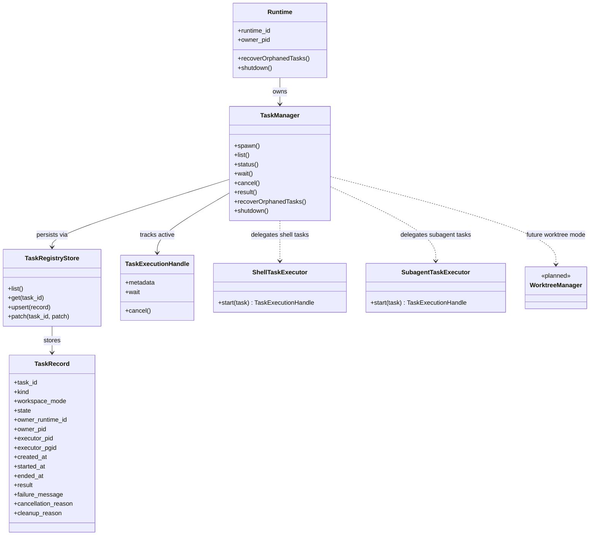
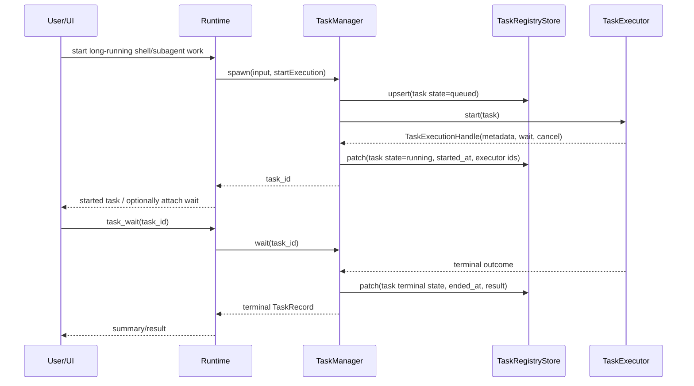
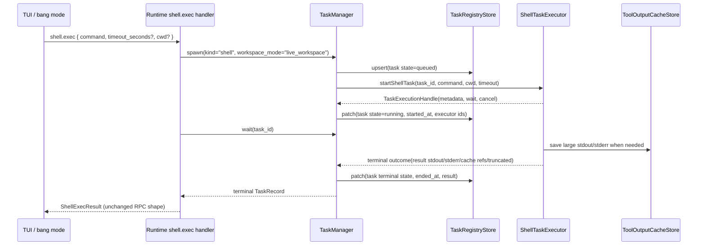
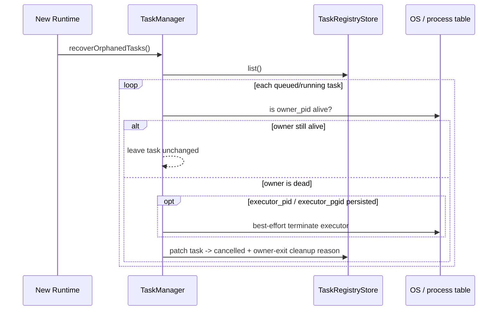

# Task Orchestration Spec (background tasks + subagents)

Status: `Proposed` (revised 2026-07-14)

This spec defines a unified orchestration model for runtime-managed long-running shell work and delegated child-agent execution while keeping the main Codelia session usable.

---

## 0. Motivation

Current background work is split conceptually:

- Bang shell background execution is planned as a job model (`shell.*`).
- Lane execution already supports autonomous multi-task work with worktree-based workspace separation.
- Subagents are listed in backlog as a bounded delegated-execution feature.

The missing piece is a single orchestration model that answers:

1. What is the public noun: `task`, `job`, or `agent`?
2. How can background work continue while the main session keeps running?
3. How should long-running shared-workspace writes such as install/setup be handled safely?
4. How are child sessions isolated from the parent session?
5. How are running child processes cleaned up so they do not linger after runtime exit?

Persistent services that must survive runtime exit are intentionally out of scope for this model; they should be started with explicit shell-native out-of-process techniques instead of task ownership.

This spec proposes a common substrate and public terminology that shell background execution and subagent execution can share.

---

## 1. Naming decision

### 1.1 Public term: `task`

Use `task` as the primary public/user-facing orchestration noun.

Rationale:

- `job` sounds implementation-centric and process-centric.
- `agent` is already overloaded with the LLM execution entity itself.
- `task` matches user intent better: "run this in the background", "delegate this", "check task status".

Examples:

- `Started background task <task_id>`
- `/tasks`
- `task_spawn`, `task_status`, `task_wait`, `task_cancel`

### 1.2 Internal term: `task`

Use `task` internally as well.

Rationale:

- Using `task` in both the public API and internal orchestration model keeps storage, manager, and UI vocabulary aligned.
- Avoiding a separate internal noun like `job` reduces translation overhead when debugging state transitions.
- A future retry/restart model can still be expressed as multiple attempts within one task record without renaming the primary abstraction.

Examples:

- `TaskRecord`
- `TaskManager`
- `task_id`
- `task.state`

### 1.3 Executor term: `TaskExecutor`

Use `TaskExecutor` (or concrete names like `shell executor` / `subagent executor`) for the implementation that runs a task.

Examples:

- `ShellTaskExecutor`
- `SubagentTaskExecutor`
- `child runtime process`

`TaskExecutor` is an implementation-side term and should not replace `task` as the main persisted/runtime abstraction.

### 1.4 Reserved term: `agent`

Use `agent` only for the LLM executor kind or runtime entity.

Examples:

- `task.kind = "subagent"`
- `child runtime process running an agent`
- `Agent` class / runtime session

---

## 2. Scope / Non-goals

### In scope

- A shared task substrate for background shell work and delegated subagents.
- Public lifecycle operations for tasks (`spawn/list/status/wait/cancel/result`).
- Session ownership rules for parent and child execution.
- Concurrency rules for multiple running tasks.
- Cleanup/shutdown behavior so owned child processes do not linger.
- Workspace execution modes for read-only live-workspace delegation and worktree-backed mutation.
- A runtime-wide capacity gate and finite per-child execution budgets.
- Host-aware child-runtime bootstrap and capability negotiation.

### Non-goals (initial)

- Recursive subagents (`child -> grandchild`).
- Arbitrary DAG scheduling / task dependencies.
- Full PTY attach for generic tasks.
- Cross-machine distributed execution.
- Perfect locking against human edits outside Codelia.

---

## 3. Design summary

Use a shared runtime-owned `TaskManager` as the orchestration layer.

```text
Codelia Runtime
  -> TaskManager
      -> TaskRegistryStore
      -> ShellTaskExecutor
      -> SubagentTaskExecutor
      -> WorktreeManager (planned follow-up for workspace_mode=worktree)
```

Key rules:

1. Every long-running backgroundable execution is represented as a `task`.
2. The main session stays usable while a task is running.
3. Each subagent task uses a fresh child session.
4. Phase 3 live-workspace subagents are read-only; edit-capable delegation requires a dedicated worktree.
5. Subagent execution is advertised only when runtime can construct a child with the same effective host/environment boundary.
6. Runtime applies finite concurrency, step, and time limits before it creates a task record.
7. Runtime owns the executor processes it creates and must clean them on exit.

### 3.1 Class diagram (MVP substrate)



### 3.2 Sequence diagram: spawn -> wait -> complete



### 3.3 Sequence diagram: task-backed `shell.exec`

This is the Phase 2 compatibility path: the external `shell.exec` RPC response stays the same, but runtime executes it as `spawn(shell task) + wait(task)` underneath.



### 3.4 Sequence diagram: startup recovery of orphaned tasks

Recovery is cleanup-only. It must not re-run shell commands or restart child agents.



---

## 4. Task kinds and workspace modes

### 4.1 Task kinds

MVP task kinds:

- `shell`
- `subagent`

Notes:

- `shell` covers bang-style or future direct shell background runs.
- `subagent` covers delegated child-agent execution with bounded scope.

### 4.2 Workspace modes

Tasks declare one workspace mode.

#### `live_workspace`

- Uses the current workspace/cwd.
- Intended to behave like running multiple long shell commands in the same workspace.
- Best-effort coordination only.
- No strict conflict guarantee is provided.
- Shell tasks may write under their normal permission policy.
- Phase 3 subagent tasks use `workspace_access="read-only"` and must not receive
  `shell`, `write`, `edit`, `apply_patch`, or other mutation-capable tools.

#### `worktree`

- Uses a dedicated git worktree.
- Intended for stronger workspace separation and conflict avoidance.
- Required before a subagent may use `workspace_access="read-write"`.
- Planned follow-up after the read-only Phase 3 MVP.

### 4.3 Recommended defaults

- `shell`: default to `live_workspace`.
- `subagent`: default to `live_workspace` + `workspace_access="read-only"`.
- edit-capable `subagent`: require `workspace_mode="worktree"`; reject the
  request until worktree-backed subagent execution is implemented.

The Phase 3 MVP is therefore useful for investigation, review, summarization,
and other non-mutating delegation. It must not present live-workspace
best-effort coordination as safe edit isolation.

### 4.4 Foreground wait vs background detach

Long-running execution should still be task-backed even when the user experiences it as foreground work.

Rules:

1. Starting a long-running shell/subagent operation in foreground creates a `task` first.
2. Foreground behavior is implemented as `wait on task`, not as a separate non-task execution path.
3. UI may detach from that wait and send the task to background without restarting it.
4. `Ctrl+B` is the canonical in-flight detach gesture while the UI is actively waiting on a task.
5. After detach, the main session returns to normal interaction while the same task continues running.

In other words, the important split is not foreground vs background execution, but attached wait vs detached wait over the same underlying task.

---

## 5. Session policy

### 5.1 Parent session remains the main conversational session

The currently attached TUI/runtime session remains the parent session.

- It stays interactive while tasks run.
- It records only spawn/wait/result summaries for child tasks.
- It does not absorb full child history by default.

### 5.2 Child session is always fresh for subagents

Each `subagent` task gets a fresh child `session_id`.

Rationale:

- Current runtime does not support concurrent execution on the same session.
- Parent and child history must remain auditable and isolated.
- Cancellation and completion should not mutate the parent history structure unexpectedly.

Creation contract:

1. Parent sends child `run.start` without `session_id`; the existing
   `session_id` field remains resume-only.
2. Child runtime creates the fresh session and returns both `run_id` and
   `session_id` in `RunStartResult`.
3. Parent persists the returned id as `TaskRecord.child_session_id` before it
   reports the task as fully running.
4. A child that cannot return a session id is a startup failure; parent must not
   invent an id that the child runtime has not created.

### 5.3 Parent-child linkage

Store linkage metadata on the task record:

- `parent_session_id`
- `parent_run_id?`
- `parent_tool_call_id?`
- `child_session_id?`

### 5.4 Result injection policy

- If the caller waits, return a structured summary/artifact result directly.
- If the task continues in background, completion does not automatically inject child history into the parent session.
- Later turns may call `task_result` or `task_wait` explicitly.

This avoids uncontrolled context pollution.

### 5.5 Subagent permission model

Subagent permission must be decided at spawn time, not interactively inside the child executor.

Rationale:

- Current permission policy defaults unknown actions to `confirm`.
- When UI confirm is unavailable, `confirm` becomes `deny`.
- A headless child runtime therefore cannot safely rely on normal nested permission prompts.

MVP rule:

- `task_spawn(kind="subagent")` establishes a delegated permission envelope.
- The parent runtime/operator approves that envelope once.
- The child executor runs non-interactively within that envelope.
- Any tool call outside the envelope is hard-denied inside the child.

The delegated permission envelope should include at minimum:

- `tool_allowlist`
- optional bash command allowlist / narrowed prefixes
- workspace mode (`live_workspace` / `worktree`)
- workspace/path scope
- step/time budget
- parent approval snapshot metadata

Policy notes:

- Child executors must not request new UI confirms on their own.
- Child executors must not widen their own permission envelope.
- Remember/allow behavior should attach to the parent `task_spawn` decision, not to hidden child-internal tool calls.
- `approval_mode=full-access` may auto-allow spawn, but the child should still be bounded by its explicit delegated envelope.

### 5.6 Delegated permission envelope (implementation sketch)

```ts
type DelegatedTaskPermission = {
  mode: "delegated";
  task_id: string;
  task_kind: "subagent";
  tool_allowlist: string[];
  workspace_access: "read-only" | "read-write";
  bash_allow?: Array<{
    command?: string;
    command_glob?: string;
  }>;
  workspace_mode: "live_workspace" | "worktree";
  workspace_root: string;
  max_steps: number;
  timeout_seconds: number;
  parent_approval: {
    approval_mode: "minimal" | "trusted" | "full-access";
    approved_at: string;
  };
};
```

Implementation rules:

- Child runtime permission evaluation must treat this envelope as a hard cap.
- Anything outside the delegated allowlist is `deny`, not `confirm`.
- Existing explicit deny rules still win over delegated allow rules.
- Child runtime must not persist new remembered allow rules from delegated execution.
- Parent runtime is responsible for presenting a human-readable summary of the delegated envelope before approval when confirmation is required.
- Parent resolves `tool_allowlist` against the actual child tool catalog before
  spawning. Unknown or unavailable tool names reject the spawn.
- `workspace_access="read-only"` hard-denies mutation tools. Because arbitrary
  shell commands cannot be classified reliably as read-only, the Phase 3
  read-only profile does not expose `shell` at all.
- `workspace_access="read-write"` requires
  `workspace_mode="worktree"`; live-workspace read-write requests reject before
  task creation.
- Request-scoped client tools are not inherited automatically. A host-provided
  executor may re-provide explicitly selected client tools inside the same
  delegated envelope.

---

## 6. Concurrency and integrity policy

### 6.1 Runtime-level ownership

A task is owned by the runtime instance that created it.

Store ownership/persistence fields:

- `owner_runtime_id`
- `owner_pid`
- `executor_pid?`
- `executor_pgid?`
- `child_session_id?`

For runtime-owned spawned executors, `executor_pid` / `executor_pgid` must be persisted so crash recovery can identify and terminate orphaned child processes from a later runtime instance.

The owning runtime is responsible for:

- status transitions
- cancellation
- final result capture
- cleanup on exit

### 6.2 Registry update serialization

`TaskRegistryStore` writes must be coordinated through `TaskManager`, but process-local serialization alone is not sufficient.

Reason:

- Multiple tasks may finish or emit status updates concurrently inside one runtime.
- Different runtimes may also inspect/recover/update task records.
- A single shared read-modify-write JSON blob risks lost updates across runtimes.

MVP requirement:

- One in-process async write queue around registry mutation inside each runtime.
- Multi-runtime-safe persistence on top of that, for example per-task files or another compare-and-swap/storage-backed approach.
- Atomic replacement still applies at the file/object level used by the chosen persistence layout.

### 6.3 Live workspace coordination

`live_workspace` tasks are best-effort by design.

MVP rules:

1. Codelia does not promise strict conflict prevention between concurrent live-workspace shell tasks.
2. Phase 3 live-workspace subagents are read-only and cannot invoke arbitrary shell commands.
3. Runtime should keep task state visible and make cancellation/detach/result retrieval reliable.
4. Edit-capable subagents remain unavailable until `worktree` support is implemented.

### 6.4 Best-effort human coexistence

Codelia does not attempt to hard-lock human edits in another terminal/editor.

Policy:

- Expose active tasks clearly in UI/logs.
- Treat both human and automated concurrent mutation in the live workspace as best-effort collaboration.
- Recommend `worktree` mode in future phases when stronger separation is needed.

### 6.5 Subagent capacity and budgets

Subagent execution is model-triggerable and consumes both OS and model-provider
resources. Non-recursive execution alone does not bound sibling fan-out.

MVP limits:

- runtime-wide active subagent default: `4`
- configurable hard maximum: `16`
- effective `max_steps`: default `50`, range `1..200`
- effective `timeout_seconds`: default `900`, range `1..3600`

Rules:

1. Capacity and budget validation runs before `TaskRegistryStore.upsert`.
2. A full capacity gate rejects with `task_capacity_exceeded`; it must not leave
   a queued record behind.
3. The runtime cap applies across parent sessions in the same runtime.
4. A parent run may not exceed the effective runtime cap by issuing repeated
   spawn calls.
5. Child `Agent.maxIterations` receives the resolved `max_steps`; it is not only
   retained as protocol metadata.
6. Timeout covers child bootstrap, model execution, tool calls, and final result
   capture. Cancellation then gets a separate short process-exit grace period.
7. Token/cost aggregate budgets are a follow-up, but usage must be retained in
   task result metadata when available so a future aggregate gate does not need
   a storage migration.

---

## 7. Lifecycle and shutdown semantics

### 7.1 Task states

Public task states:

- `queued`
- `running`
- `completed`
- `failed`
- `cancelled`

MVP keeps the public state model simple.

### 7.2 Normal completion

On success or terminal failure:

- capture final summary/result metadata
- capture output/cache refs when applicable
- mark terminal state
- record `ended_at`

### 7.3 Cancellation

`task_cancel` is best-effort and idempotent.

Cancellation behavior:

- Shell task: terminate owned process group where supported.
- Subagent task: cancel child runtime request first; if it does not exit within grace period, terminate the child process group.

### 7.4 Runtime shutdown

Default cleanup policy for runtime-owned tasks is `cancel_on_owner_exit`.

On normal runtime shutdown:

1. stop accepting new task spawns
2. send cancellation to all running owned tasks
3. wait up to a short grace period
4. force-kill remaining owned process groups
5. mark unfinished owned tasks as `cancelled` with cleanup reason

This avoids background tasks lingering and interfering after the parent runtime exits.

### 7.5 Crash or unclean exit recovery

On startup, `TaskManager` should scan the registry for running tasks owned by dead runtimes.

Recovery behavior:

- if owner PID is gone, mark the task terminal with a cleanup reason such as `owner runtime exited unexpectedly`
- if persisted `executor_pid` / `executor_pgid` still exists, best-effort terminate it before finalizing the record
- if executor identifiers were never persisted, crash-recovery cleanup is considered incomplete and the implementation does not satisfy this spec

The goal is that stale tasks do not remain forever in `running` state.

### 7.6 Result retention / GC

Task metadata and result references should be retained for a bounded period.

Recommended MVP policy:

- keep recent terminal tasks in the registry
- allow explicit `task_gc` later or reuse time-window pruning internally
- never delete running tasks through retention GC

---

## 8. Public surface

### 8.1 Agent-facing tool family

Prefer a unified task tool family for model/tool-call usage:

- `task_spawn`
- `task_list`
- `task_status`
- `task_wait`
- `task_cancel`
- `task_result`

`task_wait` represents an attached wait on an already-created task. This is the primitive that foreground UX should use under the hood.

Approval boundary rule:

- `task_spawn(kind="shell")` is still an agent/tool-call path and follows normal task/tool permission evaluation.
- UI-origin shell RPCs (`shell.exec`, future `shell.start`/`shell.wait`) may keep their existing `origin=ui_bang` no-confirm exception.
- Sharing one task substrate must not allow the UI-only shell bypass to leak into agent-originated shell tasks.

`task_spawn` input sketch:

```ts
{
  kind: "shell" | "subagent";
  background?: boolean; // detach the wait from a runtime-managed task; not a persistence guarantee
  workspace_mode?: "live_workspace" | "worktree";

  // shell
  command?: string;

  // subagent
  prompt?: string;
  tool_allowlist?: string[];
  workspace_access?: "read-only" | "read-write"; // default read-only
  max_steps?: number;

  timeout_seconds?: number; // subagent default 900s, hard max 3600s
}
```

### 8.2 UI/runtime RPC compatibility

For TUI bang-shell flow, `shell.*` RPC methods may remain as TUI-specific compatibility aliases, but the main orchestration surface should be `task_*` and both paths should use the same task substrate underneath.

Compatibility rule:

- `shell.start` returns `task_id` even if historical drafts called it `job_id`
- `shell.exec` may wrap `shell.start + shell.wait`
- `shell.*` should be treated as a compatibility/UI-facing path, not the primary general-purpose orchestration API

Capability negotiation:

- Keep `supports_tasks` as the generic task-surface gate.
- Add `supported_task_kinds?: Array<"shell" | "subagent">` to server
  capabilities.
- Until the field is implemented, omission is interpreted as shell-only; after
  implementation, shell-only runtime advertises `["shell"]`.
- Runtime adds `"subagent"` only when a usable `SubagentExecutorFactory`,
  delegated permission enforcement, finite capacity/budgets, and child-session
  result support are all active.
- Clients must not infer subagent support from the TypeScript `TaskKind` union or
  from `supports_tasks=true` alone.

Detach/wait wire requirement:

- `Ctrl+B` acceptance requires an explicit protocol method that detaches wait without cancelling the underlying task.
- This can be expressed as `shell.detach { task_id }` for the shell compatibility path or a future generic `task.detach { task_id }`.
- Until such a method is added to `packages/protocol`/`ui-protocol`, detach remains a planned protocol extension rather than an already-specified wire behavior.

### 8.3 Result shape

`task_result` / `task_wait` should return structured output.

```ts
{
  task_id: string;
  kind: "shell" | "subagent";
  state: "completed" | "failed" | "cancelled";
  summary?: string;
  summary_cache_id?: string;
  stdout?: string;
  stderr?: string;
  stdout_cache_id?: string;
  stderr_cache_id?: string;
  child_session_id?: string;
  worktree_path?: string;
  artifacts?: Array<{
    type: "file" | "patch" | "json";
    path?: string;
    ref?: string;
    description?: string;
  }>;
  usage?: {
    total_tokens: number;
    total_cost_usd?: number | null;
  };
}
```

MVP for subagent may return summary-only content, but the inline summary is
bounded to 64 KiB UTF-8. Larger final output is truncated with an explicit
marker and the full value is retained through `summary_cache_id`. Parent-facing
`task_wait` / `task_result` never inject the child transcript automatically.

### 8.4 Agent-facing tool UX follow-up requirements

Early feedback on agent-autonomous task tool usage shows that the raw substrate is useful for one-off long-running commands and a few parallel tasks, but becomes harder for the model to manage once multiple retained tasks accumulate.

Follow-up tool UX requirements:

1. `task_id` remains the canonical storage key, but the tool surface should not force the model to carry only raw ids across multiple follow-up calls.
2. Tasks should support an optional short `label` that is distinct from the generated `title` / command preview.
3. Agent-facing follow-up calls should accept either `task_id` or an unambiguous short label/reference; ambiguous references must fail with a disambiguation hint rather than guessing.
4. Task list/status responses should prioritize compact machine-readable summaries: state, label/reference, concise title/command preview, with long command text kept secondary.
5. The tool surface should make it cheap to retrieve only active/running tasks rather than repeatedly forcing the model to scan all retained history.
6. `completed` / `failed` / `cancelled` must remain explicit and easy for the model to distinguish without parsing long free-form text.

Field intent:

- `title`: auto-generated preview of the command/prompt, safe to truncate.
- `label`: short caller-supplied alias intended for repeated lookup and recall.

### 8.5 Log tail/follow and freshness requirements

`task_status` / `task_result` alone are not sufficient for long-running shell work. Agents need a cheap way to inspect the latest output without loading the full retained log payload on every follow-up call.

Requirements:

1. Shell-backed tasks should support a recent-tail view (for example "last N lines" or bounded recent bytes) as a first-class operation.
2. The tool surface should support follow-like incremental log consumption, whether implemented by repeated polling, cursors, or another bounded continuation mechanism.
3. The recent-tail path should be cheap enough for frequent refresh while a task is running.
4. Running-task status and running-task log reads should share a monotonic freshness signal (for example `output_updated_at`, `log_seq`, or equivalent snapshot/version metadata) so the caller can detect when logs are newer than a previously fetched status snapshot.
5. If exact synchronization is not possible, the API should expose freshness/staleness explicitly instead of silently presenting inconsistent progress.

This does not require the generic task substrate to stream full logs forever; the important contract is reliable `tail` + follow-style incremental monitoring for active tasks and reliable retained output lookup after completion.

---

## 9. Executor-specific behavior

### 9.1 ShellTaskExecutor

- Reuse current shell runner and sandbox rules.
- Capture stdout/stderr incrementally.
- Persist large output via tool-output cache.
- Support wait and later result retrieval.

### 9.2 SubagentTaskExecutor

Use a child runtime process, not an in-process nested run.

Rationale:

- Current runtime is single-active-run oriented.
- Child history/session separation is simpler.
- Cleanup ownership is explicit.
- Parent session remains free to continue.

MVP rules:

- child runtime is non-recursive for `task_spawn`
- child session is fresh
- child uses explicit tool allowlist and bounded budgets
- parent receives only summary/result metadata, not child event stream replay
- child startup uses an explicit host-aware launch contract; invoking the normal
  runtime entrypoint with omitted options is not a valid subagent bootstrap

#### 9.2.1 Executor factory and child bootstrap

Runtime receives a `SubagentExecutorFactory` from composition:

```ts
type SubagentExecutorFactory = {
  isAvailable(): boolean;
  start(input: SubagentLaunchInput): Promise<TaskExecutionHandle>;
};

type SubagentLaunchInput = {
  task_id: string;
  prompt: string;
  parent: {
    session_id: string;
    run_id?: string;
    tool_call_id?: string;
  };
  environment: {
    workspace_root: string;
    source_preset?: "tui-local";
    model: { provider: string; name: string; reasoning?: string };
  };
  permission: DelegatedTaskPermission;
};
```

Composition rules:

- `tui-local` provides a default process-backed factory and a dedicated child
  entrypoint.
- Custom/embedded hosts must inject a factory that can re-establish their auth,
  tools, stores, and event boundary. Host adapters are not assumed to be
  serializable.
- If the effective environment has no usable factory, runtime omits `subagent`
  from `supported_task_kinds` and rejects direct requests.
- The default process-backed factory sends the serialized bootstrap manifest
  over a dedicated inherited pipe before normal JSON-RPC initialization. Do not
  place the manifest in process arguments or environment variables.
- The manifest carries no raw credential. Local child runtime resolves auth
  through the same configured auth store; host factories own equivalent secure
  credential delivery.
- Child validates the manifest and installs the delegated permission evaluator
  before constructing `Agent` or exposing any model-callable tool.
- Child does not start MCP, client tools, project config, or persistence outside
  the effective launch contract.

#### 9.2.2 Parent-side execution flow

1. Parent runtime receives `task_spawn(kind="subagent")`.
2. Parent validates input, resolves finite budgets, and reserves runtime capacity.
3. Parent resolves/approves the delegated permission envelope and child tool catalog.
4. Parent allocates `task_id`, persists `queued`, and calls `SubagentExecutorFactory.start`.
5. Factory starts child runtime with the bootstrap manifest and obtains executor pid/pgid.
6. Parent sends `initialize`, then `run.start` without `session_id`.
7. Child creates a session and returns `{ run_id, session_id }`; parent persists `child_session_id` and marks the task `running`.
8. Parent consumes child events internally, tracks `run.status`, and extracts the final response without replaying the transcript into the parent session.
9. Parent stores bounded summary/cache/usage metadata for `task_wait` / `task_result` and releases capacity exactly once.

#### 9.2.3 Cancellation and failure handling

- `task_cancel` first maps to child `run.cancel`.
- Executor waits up to a short process-exit grace period after `run.cancel`, then force-kills the child process group and resolves the handle as `cancelled`.
- If child startup fails before `run.start`, mark task `failed` with startup error.
- If `run.start` does not return a session id, mark startup `failed` and terminate the child.
- Capacity is released on every terminal path, including bootstrap failure, timeout, cancellation, and parent shutdown.
- If parent runtime exits, normal shutdown policy applies (`cancel_on_owner_exit`).

### 9.3 Worktree-backed subagent execution (planned follow-up)

When `workspace_mode=worktree`:

- create a dedicated worktree before launching the child runtime
- associate `worktree_path` and branch metadata with the task record
- do not auto-merge into the parent workspace

This is not part of MVP. Human attach/promotion to lane is a separate concern.
Until this phase is complete, runtime rejects `workspace_access="read-write"`
for subagents rather than falling back to live-workspace mutation.

---

## 10. Relationship with lane

Lane and task orchestration solve adjacent but different problems.

- `task_*`: agent-facing delegated execution and background tracking
- `lane_*`: operator-facing autonomous lane/worktree management

Shared components are encouraged:

- worktree creation/removal helpers
- registry persistence patterns
- cleanup/GC patterns
- handoff/checkpoint metadata

But `lane` should not be the MVP implementation mechanism for `subagent` tasks because it is optimized for human-attach flows rather than structured parent-child result handling.

---

## 11. Resolved design decisions

- Naming: use `task` everywhere as the primary orchestration noun.
- Foreground detach model: all long-running execution is task-backed; foreground is attached wait over a task.
- Public MVP surface: `task_*` is the main orchestration API. `shell.*` remains only as TUI/bang compatibility aliases.
- Workspace mode: `live_workspace` is the MVP default and is explicitly best-effort. `worktree` is a planned follow-up, not part of MVP.
- Subagent permission: use spawn-time delegated permission envelopes.
- Session policy: subagent execution always uses a fresh child session. Explicit child-session resume is a follow-up question.
- Live-workspace coordination: no strict conflict-prevention guard in MVP.
- Shutdown policy: `cancel_on_owner_exit`.

## 12. Rollout plan

### Phase 1: Task substrate

- `TaskRegistryStore`
- `TaskManager`
- `TaskExecutionHandle` / executor ownership tracking
- state transitions
- cancel/wait/status/result retention
- owner-runtime cleanup on exit/startup recovery

### Phase 2: Shell tasks

- `shell.start/list/status/output/cancel/wait` as TUI/bang compatibility aliases over the task substrate
- implement on top of task substrate
- make `shell.exec` a wrapper
- foreground shell wait is task-backed, not a separate code path
- `Ctrl+B` detaches active wait to background
- TUI `/tasks` or equivalent later

### Phase 2b: Agent task tool UX polish

- optional short task labels separate from command-derived titles
- compact task list/status responses focused on active tasks and clear terminal-state signaling
- cheap recent-tail log reads (`last N lines` / bounded tail)
- follow-style incremental log reads for active tasks
- freshness metadata or shared snapshot/version semantics so status does not appear older than newer logs

### Phase 3: Subagent tasks

- `task_spawn/list/status/wait/cancel/result` for `kind="subagent"`
- host-aware `SubagentExecutorFactory` + dedicated child runtime entrypoint
- non-recursive
- read-only live-workspace profile only
- explicit tool allowlist + delegated permission hard cap
- runtime capacity gate + finite step/time budgets
- child-created fresh session returned by `run.start`
- bounded summary/cache/usage result initially

### Phase 4: Worktree-backed tasks (planned follow-up)

- `workspace_mode="worktree"`
- shared worktree helper extraction
- result metadata includes worktree/branch info
- enable `workspace_access="read-write"` subagents only after these gates pass

### Phase 5: Optional lane promotion / richer artifacts

- explicit handoff from task to lane when human attach is desired
- artifact manifests, patch refs, checkpoint metadata

---

## 13. Acceptance criteria

1. A long-running shell task can continue while the main session remains usable.
2. A delegated subagent task can continue while the main session remains usable.
3. Foreground wait for a long-running task is implemented as attached wait over a task-backed execution, not a separate execution path.
4. The user can detach an active wait with `Ctrl+B` and continue using the main session while the same task keeps running.
5. Runtime-owned background tasks do not remain indefinitely after normal runtime exit.
6. Stale running tasks from dead runtimes are recoverable and do not remain forever in `running` state.
7. Live-workspace task execution is explicitly documented as best-effort and does not promise strict conflict prevention.
8. Subagent tasks do not execute concurrently in the same child session as the parent.
9. Parent session receives bounded summaries/results rather than uncontrolled child transcript injection.
10. Agent-facing task follow-up calls do not require the model to rely on memorized full command strings alone.
11. Agent-facing task/log calls can inspect only the recent tail of a running task cheaply, without fetching the entire retained log.
12. Agent-facing task/log calls support follow-style incremental monitoring of a running task's latest output.
13. Completed / failed / cancelled remain explicit and easy for the caller to distinguish from structured task responses.
14. Status and live-log/task-log responses do not silently present inconsistent freshness; if one side is newer, the API exposes that fact.
15. `run.start` creates the child session and returns its `session_id`; a caller-supplied unknown resume id is not used as a create operation.
16. Runtime advertises `subagent` only when a usable executor factory and all Phase 3 safety gates are active.
17. Live-workspace subagents cannot call mutation tools or arbitrary shell commands.
18. Repeated spawn calls cannot exceed the runtime-wide active subagent cap and rejected requests leave no task record.
19. Effective `max_steps` reaches `Agent.maxIterations`, and all child executions receive a finite timeout.
20. A child cannot request UI confirmation, remember a rule, widen its delegated envelope, or inherit unselected client/MCP tools.
21. Every terminal/startup-failure path releases capacity once and only once.
22. Inline subagent summaries are bounded; oversized content is retained behind a cache reference.

---

## 14. Phase 3 verification scenarios

- Given an available executor and empty capacity, when a read-only subagent is
  spawned, then child `run.start` returns a new session id and the task reaches
  `running` with that id persisted.
- Given an unknown caller-supplied `session_id`, when normal `run.start` is used,
  then runtime keeps resume semantics and returns `SESSION_NOT_FOUND`.
- Given a read-only delegated envelope, when child requests `shell`, `write`,
  `edit`, or `apply_patch`, then execution is hard-denied without a UI request.
- Given a tool name absent from the child catalog, when parent validates spawn,
  then spawn fails before task persistence or process creation.
- Given the active subagent cap is reached, when another spawn is requested,
  then runtime returns `task_capacity_exceeded` and creates no task record.
- Given `max_steps` and timeout are omitted, when child Agent is constructed,
  then finite effective defaults are applied to the Agent and executor timer.
- Given child ignores `run.cancel`, when the exit grace period elapses, then the
  process group is force-killed and the task becomes `cancelled` once.
- Given parent runtime exits with a live child, when orphan recovery runs, then
  the persisted executor is terminated and capacity is not reconstructed as
  active work.
- Given a host-owned runtime without a subagent executor factory, when
  `initialize` responds, then `supported_task_kinds` omits `subagent`.
- Given final child output exceeds 64 KiB, when result is persisted, then inline
  summary is truncated explicitly and the full output has a cache id.

---

## 15. Related docs

- `dev-docs/specs/shell-background-execution.md`
- `dev-docs/specs/lane-multiplexer.md`
- `dev-docs/specs/tui-bang-shell-mode.md`
- `dev-docs/specs/ui-protocol.md`
- `dev-docs/specs/backlog.md` (`B-030`, `B-035`)
