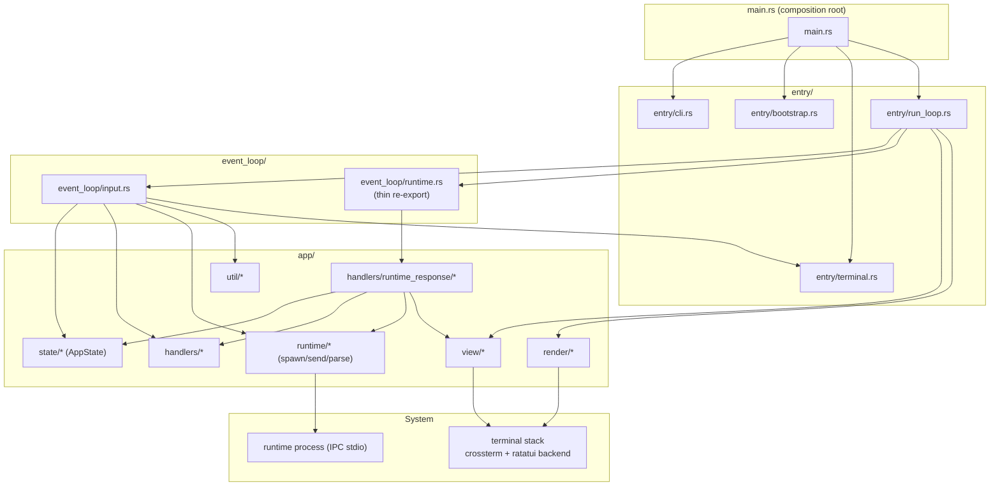
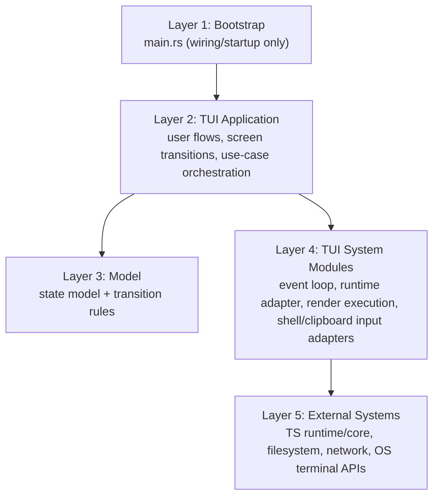

# TUI Architecture Spec

This document defines current module boundaries for `crates/tui` and provides a concrete architecture diagram for design discussion.

Status labels used in this document:

- `Implemented`: verified in current code
- `Partial`: partially achieved, with known layering leaks
- `Planned`: target state for future refactor

## 1. Current Architecture (`Implemented`)

Baseline date: **March 3, 2026**.

### 1.1 Responsibility map

- `src/main.rs`
  - Composition root for startup + lifecycle (`spawn -> run_loop -> shutdown`).
  - Wires `entry/*` and runtime bootstrap concerns.
- `src/entry/`
  - `cli.rs`: CLI parse/help/version + debug/diagnostics flag resolution.
  - `bootstrap.rs`: startup banner + initial model/session bootstrap requests.
  - `run_loop.rs`: interactive tick loop (runtime poll, input dispatch, redraw cycle).
  - `terminal.rs`: terminal lifecycle (raw mode, keyboard flags, cursor restore).
- `src/event_loop/`
  - `input.rs`: key/paste/mouse routing and dialog/panel key handling.
  - `runtime.rs`: thin re-export boundary to app-layer runtime-response handlers.
- `src/app/`
  - `state/*`: shared state buckets and UI/render state types.
  - `app_state/`: `AppState` root split by concern (`mod.rs` types/default, `methods.rs` behavior, `tests.rs`).
  - `theme.rs`: theme state and palette/color providers shared across layers.
  - `markdown/*`: markdown + code-highlight parser/render helpers shared across layers.
  - `log_wrap.rs`: shared log wrapping + styled line projection used by both `view` and `render`.
  - `handlers/*`: command/confirm/panel domain handlers.
  - `handlers/runtime_response/*`: runtime output application + RPC routing/handlers + formatters/panel builders.
  - `runtime/*`: runtime process adapter + parser + send APIs.
  - `view/*`: frame composition and markdown rendering.
  - `render/*`: terminal side-effects and inline scrollback insertion.
  - `util/*`: shared helpers (text/attachments/clipboard).

### 1.2 Current module diagram



### 1.3 Runtime tick flow (current)

```mermaid
sequenceDiagram
  participant Main as main.rs
  participant Loop as entry/run_loop
  participant ER as event_loop/runtime
  participant EI as event_loop/input
  participant AR as app/runtime
  participant S as AppState

  Main->>Loop: run_tui_loop(...)
  Loop->>ER: process_runtime_messages(...)
  ER->>AR: parse_runtime_output(line)
  ER->>S: apply parsed lines/status/rpc response

  Loop->>EI: handle key/paste/mouse events
  EI->>S: mutate input/dialog/panel state
  EI->>AR: send_* (run.cancel / prompt / pick / tool.call)

  Loop->>Loop: draw_ui + apply_terminal_effects
```

## 2. Layered Architecture Direction (`Planned`)

This project uses a practical **layered architecture** discussion model:

- Layer order is for dependency control, not "importance ranking".
- User-facing value starts in the UI/Application layer.
- Business and UI requirements are expected to change continuously.
- The key rule is still one-way dependency: higher layers may depend on lower layers, not vice versa.
- Layer dependency contract (target):
  - `L1 -> L2` only.
  - `L2 -> L3` and `L2 -> L4` are allowed.
  - `L3 -> L4` is allowed only for explicit adapter contracts where justified.
  - `L4 -> L2/L3` is not allowed in the target architecture.

### 2.1 Target layer stack



### 2.2 Current mapping (as-is -> target layer)

- Layer 1 (Bootstrap)
  - `src/main.rs`
- Layer 2 (TUI Application)
  - `src/entry/*`
  - `src/event_loop/input.rs`
  - `src/app/handlers/runtime_response/*` (runtime output application and RPC routing/handlers)
  - `src/app/handlers/*`
- Layer 3 (Model)
  - `src/app/state/*`
  - `src/app/app_state/*` (state root + state behavior helpers, with grouped runtime sub-state)
  - `src/app/theme.rs`
  - `src/app/markdown/*`
- Layer 4 (TUI System Modules)
  - (Target) runtime polling/transport-only adapters that do not mutate `AppState` directly
  - `src/app/runtime/*`
  - `src/app/render/*`
  - `src/app/view/*` (render adapter side, not pure model)
  - `src/app/util/clipboard/*` and shell/attachment IO-adjacent helpers
- Layer 5 (External Systems)
  - runtime subprocess (TS runtime/core via IPC)
  - terminal backend (`crossterm`/`ratatui`)
  - OS filesystem/network/clipboard APIs

## 3. Current Gaps Against Layered Target (`Partial`)

- `app/handlers/runtime_response/*` is now explicitly Layer 2.
  - It mutates `AppState` directly by design.
  - Remaining future option: event/command output style to further narrow direct mutation surface.
- `render`/`view` now share wrapping/projection via `app/log_wrap.rs`; no direct `render -> view` dependency remains.
- `app/state` is correctly central, but write paths are broad (many modules mutate `AppState` directly).
- `view` and runtime response handling still have some cross-concern coupling paths.

## 4. Refactor Steps For Layered Shape (`Planned`)

1. Done: split runtime response handling into domain slices (`session/model/lane/mcp/skills/context_inspect/run_control`).
2. Done: keep top-level id router (`handlers/runtime_response/mod.rs`) and delegate to domain handlers.
3. Next: define explicit model-transition entrypoints (reduce direct free-form `AppState` mutation paths).
4. Done: isolate parsed-output application (`handlers/runtime_response/parsed_output.rs`) from rpc-router.
5. Done: move runtime response handling to explicit Layer 2 location (`app/handlers/runtime_response/*`).
6. Next: keep adapters (`runtime`, terminal, clipboard, shell input) in the system-modules layer with clearer boundaries.

## 5. Discussion Questions

1. Which files should be canonical Layer 2 (Application) boundaries?
2. Do we want `AppState` mutation mediated through explicit transition functions only?
3. Should `view` be split into pure projection vs terminal adapter modules?
