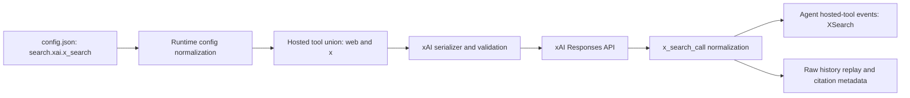

# xAI Native Provider Spec

Status: Implemented
Date: 2026-07-18

## Goal

Provide native xAI API access for Grok without routing through OpenRouter.
Core owns the Responses API adapter; runtime owns auth, configuration, model
selection, onboarding, hosted-search policy, and static model listing.

## Official API findings

Verified against xAI's official documentation on 2026-07-18, with X Search
details refreshed on 2026-07-19:

- Provider id: `xai`
- Default model: `grok-4.5`
- Base URL: `https://api.x.ai/v1`
- Generation endpoint: `POST /responses`
- Auth: `Authorization: Bearer <XAI_API_KEY>`
- The official JavaScript example uses the OpenAI SDK with xAI's base URL.
- `grok-4.5` supports Responses API and Chat Completions; Responses is the
  preferred Codelia boundary because it matches Codelia's multimodal/tool replay
  model and xAI's current agent examples.
- `grok-4.5` has a 500,000-token context window and supports text/image input,
  function calling, structured outputs, and reasoning.
- Requests above 200K context enter xAI's higher-context pricing tier. Codelia
  therefore keeps the static context window at 500K but uses a 200K normal
  `maxInputTokens` safety boundary.
- Reasoning accepts `low`, `medium`, or `high`; default is `high` and reasoning
  cannot be disabled. Codelia maps `xhigh` and `max` to `high` and records the
  fallback.
- Reasoning summaries stream as `response.reasoning_text.delta` and/or
  `response.reasoning_summary_text.delta`.
- Stateless reasoning continuity uses
  `include: ["reasoning.encrypted_content"]` and replay of the encrypted
  reasoning item.
- Function tools, `auto|required|none|specific` tool choice, parallel calls,
  and Responses function-call outputs are supported. xAI treats tool schemas as
  strict regardless of the supplied `strict` flag; Codelia still performs its
  own runtime Zod validation.
- `prompt_cache_key` is the Responses API cache-affinity field and should be a
  stable conversation id. Cache hits appear in
  `usage.input_tokens_details.cached_tokens`.
- Images can be public URLs or base64 data URLs. Supported formats are
  JPG/JPEG and PNG, up to 20 MiB per image.
- xAI-native `web_search` is available through the Responses tool shape.
- xAI `web_search.allowed_domains` accepts at most five domains; Codelia rejects
  larger provider-specific configurations before transport.
- X Search uses the Responses `{"type":"x_search"}` tool. It supports keyword,
  semantic, user, and thread lookup against X posts, plus optional image/video
  understanding.
- X Search accepts up to 20 `allowed_x_handles` or 20 `excluded_x_handles`, but
  not both. Codelia strips a leading `@` and validates these limits before
  transport.
- X Search `from_date` and `to_date` are inclusive `YYYY-MM-DD` boundaries.
  Codelia validates calendar dates and rejects inverted ranges before transport.
- X Search is billed per tool call, so Codelia keeps it explicit opt-in rather
  than coupling it to web-search auto selection.
- Authenticated model discovery is available at `GET /v1/language-models`, but
  dynamic discovery is deferred until Codelia also models per-model reasoning
  and tool capabilities from that response.

Official references:

- `https://docs.x.ai/developers/grok-4-5`
- `https://docs.x.ai/developers/models/grok-4.5`
- `https://docs.x.ai/developers/model-capabilities/text/reasoning`
- `https://docs.x.ai/developers/tools/function-calling`
- `https://docs.x.ai/developers/model-capabilities/text/structured-outputs`
- `https://docs.x.ai/developers/model-capabilities/images/understanding`
- `https://docs.x.ai/developers/tools/web-search`
- `https://docs.x.ai/developers/tools/x-search`
- `https://docs.x.ai/developers/pricing`
- `https://docs.x.ai/developers/advanced-api-usage/prompt-caching/maximizing-cache-hits`
- `https://docs.x.ai/developers/rest-api-reference/inference/models`

## Target contract

- `model.provider=xai`
- `XAI_API_KEY` or saved API-key auth
- optional `XAI_BASE_URL`
- `/model xai` and onboarding provider selection
- static `grok-4.5` model listing/details, including provider aliases
  `grok-4.5-latest` and `grok-build-latest`
- default one-hour client timeout for long reasoning requests
- Responses streaming with `store=false`, encrypted-reasoning inclusion, and
  `prompt_cache_key` derived from Codelia's session key
- provider diagnostics through `CODELIA_PROVIDER_LOG` without API-key output
- `search.mode=auto|native` may select xAI hosted web search
- `search.xai.x_search.enabled=true` independently opts into X Search; the
  default is disabled and non-xAI providers ignore the setting

## Core design

Add `ChatXai` under `packages/core/src/llm/xai/`. The adapter reuses Codelia's
well-tested OpenAI Responses wire serializer through a narrow xAI bridge:

- xAI-owned opaque output parts are tagged `provider: "xai"` in shared history;
- those parts are converted back to Responses-compatible items only for xAI;
- hosted `web_search` is mapped to the Responses tool shape;
- xAI Web Search wire tools are built from an explicit provider allowlist;
  shared `search_context_size` and `user_location` values are not forwarded,
  while supported domain filters remain intact;
- hosted `x_search` stays xAI-specific and is never routed through the shared
  OpenAI or Anthropic web-search serializer;
- hosted search preserves up to five `allowed_domains` and rejects larger lists
  before network I/O;
- X Search normalizes handle filters, validates provider limits and date ranges,
  retains structured response citations in `provider_meta.citations`, and
  replays raw `x_search_call` items for stateless multi-turn continuity;
- function calls/results and encrypted reasoning items retain their wire IDs;
- PNG/JPEG inputs are preserved and unsupported inline media types fail before
  network I/O;
- completion usage, cached input, stop status, and reasoning fallback metadata
  are normalized into the shared contract.

This keeps `ChatOpenAI`'s OpenAI-specific websocket/OAuth behavior out of xAI
while sharing the stable Responses serialization boundary.

## Runtime design

Add `xai` to provider identity, static registry aliases, metadata filtering,
provider-qualified model parsing, auth resolution, model factory construction,
model list/set validation, onboarding, and the TUI provider picker.

Runtime composes X Search independently from web search. This means local web
search and hosted X Search can coexist, while an X Search configuration never
satisfies or changes the `search.mode=native` web-search availability check.
Normalized `x_search_call` items emit hosted tool events with tool id
`x_search` and display name `XSearch`.

Reasoning mapping:

| Requested | Sent to xAI | Fallback |
| --- | --- | --- |
| `low` | `low` | no |
| `medium` | `medium` | no |
| `high` | `high` | no |
| `xhigh` | `high` | yes |
| `max` | `high` | yes |

## Verification plan

Focused behavior tests will cover:

- Responses request shape, auth/base URL construction, session cache key,
  encrypted reasoning inclusion, and one-hour timeout;
- streamed reasoning/text/tool-call normalization and usage/cache accounting;
- function tool/result replay and xAI-owned opaque part replay;
- PNG/JPEG preservation plus early rejection of unsupported inline image media;
- reasoning fallback mapping;
- auth, runtime model factory, agent construction, static registry/list/set, and
  TUI provider selection;
- hosted web-search composition.
- opt-in X Search config parsing/merging, web-search coexistence, xAI-only
  composition, exact wire shape, filter/date validation, citation retention,
  hosted-tool lifecycle, and raw history replay.

Repository gates will include focused Bun tests, `bun run fmt`,
`bun run typecheck`, dependency/version checks, full `bun run test`, relevant
Rust TUI tests, and a secret scan. Live API verification is conditional on an
explicit integration environment and is not required for deterministic CI.

## Verification record

Base provider verification was completed on 2026-07-18. X Search verification
was added on 2026-07-19:

- focused config/runtime/core/Agent tests: 72 passed, 0 failed;
- `bun run typecheck`: passed;
- `bun run check:deps`: passed;
- `bun run check:versions`: passed;
- `bun run test`: passed (647 JavaScript tests passed, 2 skipped;
  13 Terminal-Bench tests passed; 230 Rust TUI tests passed);
- targeted Biome check across 15 affected TypeScript files: no errors, with one
  pre-existing optional-chain warning in the Anthropic serializer;
- `git diff --check`: passed.

The original native-provider verification record is retained below:

- focused xAI/core/runtime tests: 81 passed, 0 failed;
- Rust TUI provider-picker test: passed;
- `bun run typecheck`: passed;
- `bun run check:deps`: passed;
- `bun run check:versions`: passed;
- `bun run test`: passed (640 JavaScript tests passed, 2 skipped;
  13 Terminal-Bench tests passed; 230 Rust TUI tests passed);
- high-confidence secret scan across tracked changes and new files: clean;
- changed-file Biome check: passed, with one existing warning in
  `packages/runtime/src/auth/resolver.ts`;
- `git diff --check`: passed.

The post-implementation review finding for xAI's five-domain web-search limit
is covered by boundary tests that preserve exactly five domains and reject six
before transport.

The follow-up wire review found that reusing the OpenAI hosted-search serializer
also forwarded unsupported `search_context_size` and `user_location` values.
The xAI bridge now constructs an exact provider-specific Web Search tool and a
runtime-to-core regression test verifies those shared options are omitted.

`bun run check` still reports repository-wide pre-existing Biome debt (13
errors and 26 warnings) outside this change's introduced lines. No live xAI API
request was made because deterministic verification does not require an API key
and live integration remains opt-in.

## Deferred

- dynamic `/v1/language-models` selection
- code execution, collections, remote MCP, and multi-agent Grok
- stateful `previous_response_id` storage
- image/video generation and audio/voice APIs
- opt-in live integration smoke tests
