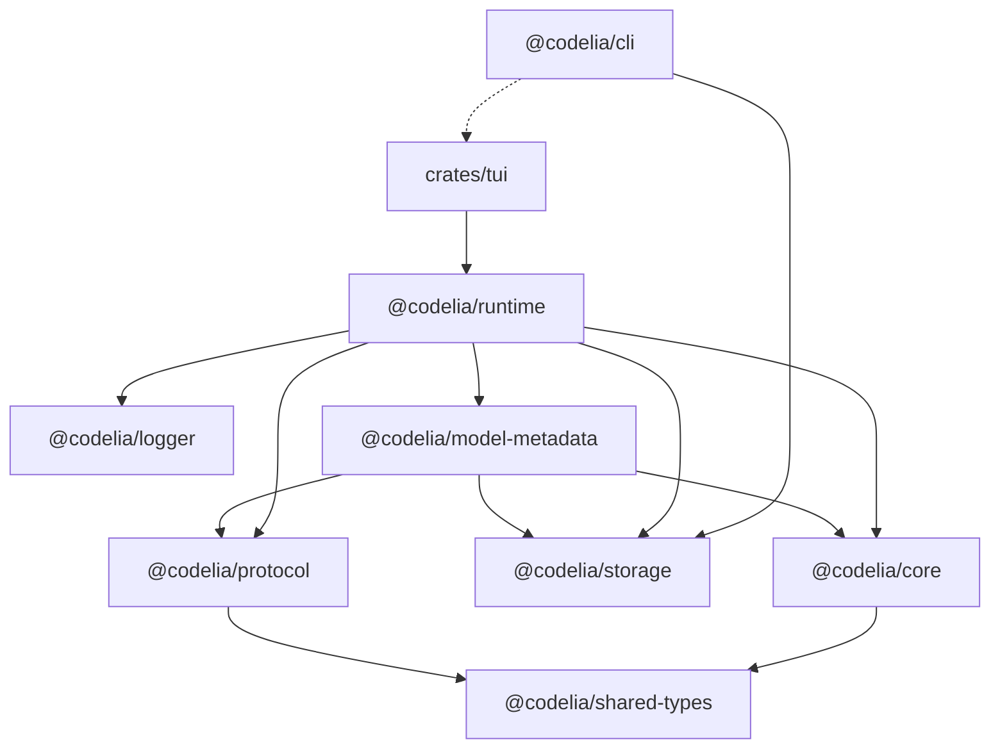

# codelia Architecture Overview

This document summarizes the core architecture of codelia and the package
boundaries used in this monorepo.

---

## 1. Core loop (mental model)

The agent is a simple loop:

```
User
  │
  ▼
Agent.run/runStream
  │  (messages + tools)
  ▼
LLM (BaseChatModel.ainvoke)
  │  └─ messages[] (assistant/reasoning/tool_calls in sequence)
  ▼
Tool execution
  │  └─ ToolMessage
  ▼
Agent loop (repeat)
  │
  └─ Final response or done signal
```

---

## 2. Package responsibilities

- `@codelia/core`
  - Agent loop, message history, tools, context management, and provider adapters.
- `@codelia/shared-types`
  - Cross-boundary stable types shared by core/protocol/runtime.
- `@codelia/protocol`
  - Core-independent UI/runtime wire protocol types and method names.
- `@codelia/logger`
  - Shared logging helpers (stderr logger and debug flag helpers).
- `@codelia/runtime`
  - JSON-RPC runtime server that connects UI/TUI to core tools and agents.
- `@codelia/storage`
  - Session logs and resume state persistence.
- `@codelia/model-metadata`
  - Model metadata resolution and registry helpers.
- `@codelia/cli`
  - Product entrypoint that launches TUI/runtime paths (no core/tool implementation).
- `crates/tui`
  - Rust TUI client that drives the runtime.

---

## 3. Context management

- Tool output cache trims large tool outputs and keeps references for replay.
- Compaction summarizes history when context usage is high.
- Usage tracking aggregates token usage across runs.

---

## 4. Module dependency diagram

Dependency direction:
- `A --> B` means "A depends on B".
- `A -.-> B` means "A spawns/calls B as a process" (not a build-time dependency).


