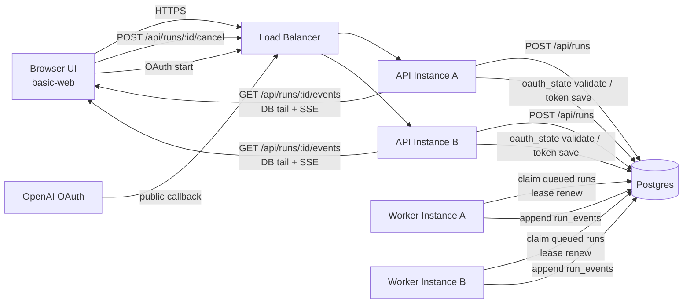

# Agentic Web Spec（durable-lite / platform-agnostic）

この文書は、`examples/basic-web` を発展させた **agentic web** の実行アーキテクチャ仕様を定義する。
主眼は「UI を維持しつつ、マルチインスタンス環境で壊れない run 実行モデル」を作ること。

---

## 0. 現状ギャップ（`basic-web` 前提のままでは壊れる点）

`examples/basic-web` は単一プロセス開発体験を優先した実装であり、LB 配下のマルチインスタンスでは次の前提が崩れる。

1. `AgentPool` がプロセス内メモリを正本としており、run/cancel の整合がインスタンスを跨いで維持できない
2. OAuth `state`/PKCE verifier が in-memory + loopback callback 前提で、公開 callback の到達ノードで検証できない
3. local settings/auth/session 保存がノードローカル前提で、API 着地点ごとに状態が分岐しうる

したがって agentic-web では、**UI は流用し、実行責務を durable-lite（API/Worker/Postgres/SSE tail）へ分離**する。

---

## 1. 目的

1. `basic-web` ベースの UI/UX を維持しながら、実行面を durable 化する
2. LB 配下の複数 API/Worker インスタンスでも、run/cancel/event 配信の整合性を保つ
3. プラットフォーム依存を最小化し、Cloud Run / Kubernetes / VM いずれでも同一設計を使えるようにする
4. Temporal なしで運用可能な最小構成（durable-lite）を示す

---

## 2. 非目的

1. 本仕様は長期ワークフローエンジン（Temporal 相当）の完全代替を目指さない
2. LLM 呼び出しの「途中再開」を保証しない（失敗時は fail/retry を明示する）
3. UI を全面刷新しない（`basic-web` ベースを前提）

---

## 3. 全体構成

```text
Browser(UI)
  -> API service
       -> Postgres (runs / run_events / sessions / settings / auth / oauth_state)
       -> optional notifier (LISTEN/NOTIFY, Redis PubSub, etc.)

Worker service
  -> Postgres から run を claim
  -> Agent.runStream 実行
  -> run_events へ append
```

### 3.1 ネットワーク図



### 3.2 コンポーネント責務

- UI (`basic-web` ベース)
  - session 一覧/チャット表示
  - `POST /runs` で実行開始
  - SSE で run events を購読
  - `POST /runs/:id/cancel` でキャンセル
- API
  - run enqueue / cancel / SSE 配信
  - settings/auth 更新 API
  - OAuth callback 受付（state 検証・token 永続化）
- Worker
  - run claim / lease 更新 / runStream 実行
  - event append / outcome 確定
- Postgres
  - durable source of truth

---

## 4. Durable-lite 原則

1. **run 実行状態をメモリに持たない**
2. **SSE の正本は DB の event log**（in-memory broker は補助）
3. **cancel は DB フラグで表現**（worker が協調停止）
4. **owner/lease を DB で管理**（インスタンス跨ぎで整合）

---

## 5. データモデル（最小）

### 5.1 runs

```sql
create table runs (
  run_id text primary key,
  session_id text not null,
  status text not null check (status in ('queued','running','completed','failed','cancelled')),
  input_text text not null,
  created_at timestamptz not null default now(),
  started_at timestamptz,
  finished_at timestamptz,
  owner_id text,
  lease_until timestamptz,
  cancel_requested_at timestamptz,
  error_message text
);
create index runs_status_created_idx on runs(status, created_at);
create index runs_owner_idx on runs(owner_id);
```

### 5.2 run_events

```sql
create table run_events (
  run_id text not null references runs(run_id) on delete cascade,
  seq bigint not null,
  event_type text not null,
  payload jsonb not null,
  created_at timestamptz not null default now(),
  primary key (run_id, seq)
);
create index run_events_created_idx on run_events(run_id, created_at);
```

### 5.3 sessions / settings / auth

- `sessions`: 既存 `session state` を DB へ移行（message history）
- `settings`: provider/model/reasoning/API key など
- `auth`: OAuth token（暗号化 at-rest 前提）
- `oauth_state`: OAuth `state`, code_verifier, expires_at

---

## 6. Worker 実行モデル

### 6.1 claim

ワーカーは次を繰り返す。

1. transaction 開始
2. `queued` または lease 期限切れ `running` を 1 件取得（`FOR UPDATE SKIP LOCKED`）
3. `status='running', owner_id=<worker>, lease_until=now()+lease_window` に更新
4. commit

### 6.2 run 実行

1. `run.start` 相当イベントを append
2. `Agent.runStream(...)` のイベントを `run_events` へ順次 append
3. 定期的に lease 更新
4. `cancel_requested_at` を定期チェック
5. 終了時に `runs.status` を terminal 状態へ更新

### 6.3 冪等性

- `run_events` は `(run_id, seq)` 主キーで二重書き込みを防ぐ
- worker 再実行時は `max(seq)` から再開、または `failed` 化して再 enqueue 方針を採る

---

## 7. API 契約

### 7.1 Run API

- `POST /api/runs`
  - request: `{ session_id, message }`
  - response: `{ run_id, status: "queued" }`
- `POST /api/runs/:run_id/cancel`
  - runs.cancel_requested_at をセット
- `GET /api/runs/:run_id`
  - run 状態参照

### 7.2 SSE API

- `GET /api/runs/:run_id/events`
- `Last-Event-ID` を `seq` として扱う
- API は DB tail により `seq > cursor` を順序保証で配信
- run terminal 到達時に `done` を送信して接続終了

### 7.3 Session API

`basic-web` の session API は概ね維持し、裏側ストレージを DB に置換する。

---

## 8. SSE 配信方式

### 8.1 基本

- API は polling tail を標準実装とする
- 取得クエリ:

```sql
select seq, event_type, payload
from run_events
where run_id = $1 and seq > $2
order by seq asc
limit 100;
```

### 8.2 最適化（任意）

- `LISTEN/NOTIFY` または Redis Pub/Sub で API の wake-up を高速化
- ただし durable source は常に `run_events`（通知ロス許容）

---

## 9. Cancel/Timeout/Recovery

1. cancel 要求は DB フラグ化のみ（同期 abort を期待しない）
2. worker はイベント境界で cancel フラグ確認し、`cancelled` 終了へ遷移
3. worker 異常終了時、lease 期限切れで再 claim 可能にする
4. 再開不能と判断した run は `failed` とし、UI に明示表示する

---

## 10. OAuth（マルチインスタンス対応）

`basic-web` の単一インスタンス向けローカル callback 実装は、agentic web では次の方針へ切替える。

1. OAuth `state`/PKCE verifier は DB (`oauth_state`) に TTL 付き保存
2. callback は公開 URI で API が受ける
3. callback 到着ノードは DB の `state` を検証して token 永続化
4. token refresh も DB 更新で一貫化

注記: ローカル開発プロファイルでは既存 loopback callback を維持してよい。

### 10.1 OAuth プロファイル

- `dev-local`:
  - loopback callback（`http://localhost:<port>/auth/callback`）を許容
  - ただし agentic-web 実装では `oauth_state` テーブル経由の検証コードパスを保持する（切替可能にする）
- `prod`:
  - 公開 callback（例: `https://<domain>/api/oauth/openai/callback`）のみ許容
  - `oauth_state` は DB に TTL 付き保存し、callback 到着ノードで必ず state を 1 回消費（replay 防止）

---

## 11. ローカル開発プロファイル（推奨）

`docker compose` で以下を起動する。

1. `postgres`
2. `api`
3. `worker`
4. `web`（Vite dev or static）

### 11.1 方針

- ローカルで本番同等の責務分離（api/worker）を再現する
- Cloud 固有サービス（Cloud Tasks, Pub/Sub）なしで動作可能にする

---

## 12. Cloud Run へのマッピング（例）

- `api`: Cloud Run service
- `worker`: Cloud Run service（常時1+インスタンス、concurrency 1 推奨）
- DB: Cloud SQL (Postgres)
- optional trigger: Cloud Tasks / PubSub（なくても polling worker で可）

重要: このマッピングはデプロイ例であり、アプリ契約は platform-agnostic とする。

---

## 13. `basic-web` からの移行順序

### Phase 0: 契約固定（UI は維持）

1. UI の送受信契約を `POST /api/runs` + `GET /api/runs/:run_id/events` に寄せる
2. `Last-Event-ID` 再接続を UI/API 双方で必須化する
3. 既存 `/api/chat/:sessionId` は後方互換エンドポイントとしてのみ残す

### Phase 1: Durable run path

1. `run_id` を導入し、chat 直実行を `POST /runs` enqueue 化
2. worker claim + lease + cancel フラグを `runs` テーブルで実装
3. `run_events` への append を正本化し、API は DB tail SSE 配信へ切替

### Phase 2: Stateful data の DB 移行

1. session/settings/auth を DB 永続化へ移行
2. `AgentPool` 依存の in-memory run lifecycle を廃止
3. API 着地点に依存しない read/write 一貫性を担保

### Phase 3: OAuth 本番化

1. OAuth state を `oauth_state` DB 管理へ移行（TTL + one-time consume）
2. 公開 callback 方式を標準化し、loopback は `dev-local` 限定にする
3. token refresh を DB 更新経由で一元化する

---

## 14. 受け入れ条件

1. API がどのインスタンスに着地しても同じ run/event が観測できる
2. worker 再起動後も run 整合性（completed/failed/cancelled）が壊れない
3. SSE 再接続で event 欠落が起きない（`Last-Event-ID` 再送）
4. settings/auth/OAuth state が単一ノードメモリに依存しない
5. UI は `basic-web` ベースを維持しつつ動作する
6. 本番プロファイルで公開 callback + DB state 検証が機能する

---

## 15. 実装メモ（interface 案）

```ts
export interface RunQueue {
  enqueue(input: { sessionId: string; message: string }): Promise<{ runId: string }>;
  claim(workerId: string): Promise<RunClaim | null>;
  renewLease(runId: string, workerId: string): Promise<boolean>;
  requestCancel(runId: string): Promise<void>;
}

export interface RunEventStore {
  append(runId: string, event: { seq: number; type: string; payload: unknown }): Promise<void>;
  listAfter(runId: string, seq: number, limit: number): Promise<Array<{ seq: number; type: string; payload: unknown }>>;
}
```

この interface は実装を固定しない。Postgres 実装を標準とし、必要に応じて別 backend を追加する。

---

## 16. Sandbox Security（参照）

worker 実行時の sandbox セキュリティ（OS レベル隔離、`bash` 実行ポリシー、段階導入案）は
`docs/specs/sandbox-isolation.md` を参照する。

要点:
1. session-dir 分離 / TTL cleanup / session sticky は整合性対策として維持する。
2. セキュリティ境界は OS レベル隔離（`bwrap`/`nsjail` 等）で担保し、raw `bash` は本番デフォルト無効とする。
3. OAuth token / API key / config は worker 親プロセスで解決し、run 実行側には最小限の実行スナップショットのみを注入する。
4. user 境界を `settings/auth/runs/sessions/sandbox` に一貫適用し、越境参照を防ぐ。
