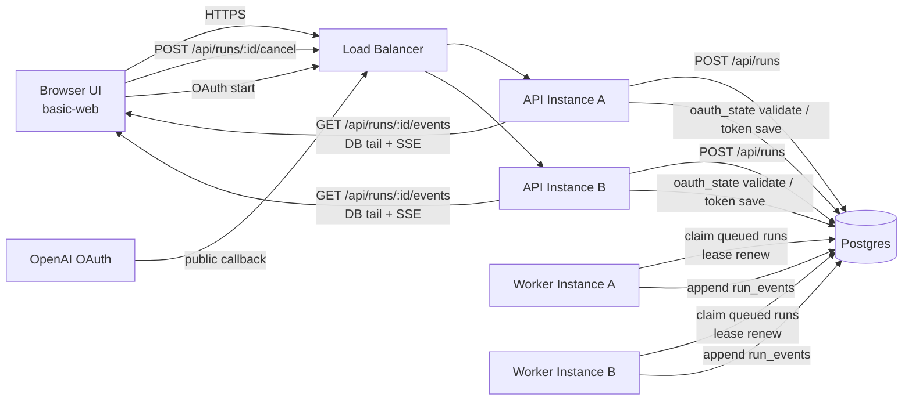

# Agentic Web Spec（durable-lite / platform-agnostic）

This document defines an execution architecture specification for the **agentic web** that is an evolution of `examples/basic-web`.
The main focus is to create a `run execution model that will not break in a multi-instance environment while maintaining the UI`.
---

## 0. Current gap (point that will break if `basic-web` assumption is left as is)
`examples/basic-web` is an implementation that prioritizes single-process development experience, and the following assumptions are broken in multi-instances under LB.
1. `AgentPool` uses in-process memory as the original, and run/cancel consistency cannot be maintained across instances.
2. OAuth `state`/PKCE verifier assumes in-memory + loopback callback and cannot be verified on the public callback reachable node
3. Local settings/auth/session is assumed to be saved locally on the node, and the state may diverge depending on the API destination.
Therefore, in agentic-web, the UI is reused and the execution responsibility is separated into durable-lite (API/Worker/Postgres/SSE tail).
---

## 1. Purpose
1. Make the execution surface durable while maintaining the `basic-web`-based UI/UX
2. Maintain consistency in run/cancel/event distribution even with multiple API/Worker instances under LB
3. Minimize platform dependencies and use the same design for Cloud Run / Kubernetes / VM
4. Showing the minimum configuration (durable-lite) that can be operated without Temporal
---

## 2. Non-purpose
1. This specification does not aim to completely replace long-term workflow engines (equivalent to Temporal).
2. Does not guarantee "midway restart" of LLM call (clearly indicates fail/retry in case of failure)
3. Do not completely redesign the UI (assumes `basic-web` base)
---

## 3. Overall configuration
```text
Browser(UI)
  -> API service
       -> Postgres (runs / run_events / sessions / settings / auth / oauth_state)
       -> optional notifier (LISTEN/NOTIFY, Redis PubSub, etc.)

Worker service
-> Claim run from Postgres
-> Agent.runStream run
-> append to run_events
```

### 3.1 Network diagram


### 3.2 Component Responsibilities
- UI (`basic-web` based)
  - session list/chat display
  - Start execution with `POST /runs`
  - Subscribe to run events with SSE
  - Cancel with `POST /runs/:id/cancel`
- API
  - run enqueue / cancel / SSE delivery
  - settings/auth update API
  - OAuth callback reception (state verification/token persistence)
- Worker
  - run claim / lease update / runStream execution
  - event append / outcome confirmed
- Postgres
  - durable source of truth
---

## 4. Durable-lite principle
1. **run does not keep execution state in memory**
2. **The original SSE is the DB event log** (in-memory broker is auxiliary)
3. **cancel is expressed as a DB flag** (workers cooperatively stop)
4. **Manage owner/lease in DB** (consistent across instances)
---

## 5. Data model (minimum)
### 5.1 runs

```sql
create table runs (
  run_id text primary key,
  session_id text not null,
  status text not null check (status in ('queued','running','completed','failed','cancelled')),
  input_text text not null,
  created_at timestamptz not null default now(),
  started_at timestamptz,
  finished_at timestamptz,
  owner_id text,
  lease_until timestamptz,
  cancel_requested_at timestamptz,
  error_message text
);
create index runs_status_created_idx on runs(status, created_at);
create index runs_owner_idx on runs(owner_id);
```

### 5.2 run_events

```sql
create table run_events (
  run_id text not null references runs(run_id) on delete cascade,
  seq bigint not null,
  event_type text not null,
  payload jsonb not null,
  created_at timestamptz not null default now(),
  primary key (run_id, seq)
);
create index run_events_created_idx on run_events(run_id, created_at);
```

### 5.3 sessions / settings / auth

- `sessions`: Migrate existing `session state` to DB (message history)
- `settings`: provider/model/reasoning/API key etc.
- `auth`: OAuth token (assuming encryption at-rest)
- `oauth_state`: OAuth `state`, code_verifier, expires_at
---

## 6. Worker execution model
### 6.1 claim

The worker repeats:
1. Transaction start
2. Get one `queued` or lease expired `running` (`FOR UPDATE SKIP LOCKED`)
3. Updated to `status='running', owner_id=<worker>, lease_until=now()+lease_window`
4. commit
### 6.2 run
1. Append event corresponding to `run.start`
2. Append events of `Agent.runStream(...)` to `run_events` sequentially
3. Regular lease renewal
4. Regularly check `cancel_requested_at`
5. Update `runs.status` to terminal state on exit
### 6.3 Idempotency
- `run_events` prevents double writes with `(run_id, seq)` primary key
- When re-executing workers, restart from `max(seq)` or change to `failed` and re-enqueue.
---

## 7. API Agreement
### 7.1 Run API

- `POST /api/runs`
  - request: `{ session_id, message }`
  - response: `{ run_id, status: "queued" }`
- `POST /api/runs/:run_id/cancel`
  - set runs.cancel_requested_at
- `GET /api/runs/:run_id`
  - Run status reference
### 7.2 SSE API

- `GET /api/runs/:run_id/events`
- Treat `Last-Event-ID` as `seq`
- API delivers `seq > cursor` with guaranteed ordering via DB tail
- run terminal When reached, send `done` and end the connection
### 7.3 Session API

Most of the session API of `basic-web` will be maintained and the backside storage will be replaced with DB.
---

## 8. SSE delivery method
### 8.1 Basics
- API uses polling tail as standard implementation
- Get query:
```sql
select seq, event_type, payload
from run_events
where run_id = $1 and seq > $2
order by seq asc
limit 100;
```

### 8.2 Optimization (optional)
- Speed up API wake-up with `LISTEN/NOTIFY` or Redis Pub/Sub
- However, durable source is always `run_events` (notification loss tolerance)
---

## 9. Cancel/Timeout/Recovery

1. Cancel request only flags DB (does not expect synchronous abort)
2. The worker checks the cancel flag at the event boundary and transitions to `cancelled` termination.
3. When a worker terminates abnormally, it is possible to re-claim after the lease expires.
4. Runs determined to be unresumable are marked `failed` and clearly displayed on the UI.
---

## 10. OAuth (multi-instance compatible)
The local callback implementation for a single instance of `basic-web` will be switched to the next policy in agentic web.
1. OAuth `state`/PKCE verifier is saved in DB (`oauth_state`) with TTL
2. Callback is received by API with public URI
3. Callback arrival node verifies `state` of DB and persists token
4. Token refresh is also consistent with DB updates
Note: Local development profiles may retain existing loopback callbacks.
### 10.1 OAuth Profile
- `dev-local`:
  - Allow loopback callback (`http://localhost:<port>/auth/callback`)
  - However, the agentic-web implementation maintains the validation code path via the `oauth_state` table (makes it switchable)
- `prod`:
  - Only public callbacks (e.g. `https://<domain>/api/oauth/openai/callback`) are allowed
  - `oauth_state` is saved in the DB with a TTL, and the state is always consumed once at the callback arrival node (replay prevention)
---

## 11. Local development profile (recommended)
Start the following with `docker compose`.
1. `postgres`
2. `api`
3. `worker`
4. `web`（Vite dev or static）

### 11.1 Policy
- Reproduce the same separation of responsibilities (api/worker) as in production locally
- Enable to operate without Cloud specific services (Cloud Tasks, Pub/Sub)
---

## 12. Mapping to Cloud Run (example)
- `api`: Cloud Run service
- `worker`: Cloud Run service (always 1+ instances, concurrency 1 recommended)
- DB: Cloud SQL (Postgres)
- optional trigger: Cloud Tasks / PubSub (even if not, you can use polling worker)
Important: This mapping is an example deployment and the app contract is platform-agnostic.
---

## 13. Migration order from `basic-web`
### Phase 0: Fixed contract (UI maintained)
1. Submit the UI transmission and reception contract to `POST /api/runs` + `GET /api/runs/:run_id/events`
2. `Last-Event-ID` Require reconnection in both UI/API
3. Existing `/api/chat/:sessionId` will remain only as a backward compatible endpoint
### Phase 1: Durable run path

1. Introducing `run_id` and converting chat direct execution to `POST /runs` enqueue
2. Implement worker claim + lease + cancel flags in `runs` table
3. Make the append to `run_events` original and switch the API to DB tail SSE distribution
### Phase 2: Stateful data DB migration
1. Migrate session/settings/auth to DB persistence
2. Abolished in-memory run lifecycle dependent on `AgentPool`
3. Ensures read/write consistency independent of API destination
### Phase 3: OAuth production
1. Migrate OAuth state to `oauth_state` DB management (TTL + one-time consume)
2. Standardize public callback method and limit loopback to `dev-local`
3. Centralize token refresh via DB update
---

## 14. Acceptance Conditions
1. The same run/event can be observed no matter which instance the API lands on
2. Run consistency (completed/failed/cancelled) is not broken even after worker restart
3. SSE reconnection does not cause event loss (`Last-Event-ID` retransmission)
4. settings/auth/OAuth state does not depend on single node memory
5. UI works while maintaining `basic-web` base
6. Public callback + DB state validation works in production profile
---

## 15. Implementation memo (draft interface)
```ts
export interface RunQueue {
  enqueue(input: { sessionId: string; message: string }): Promise<{ runId: string }>;
  claim(workerId: string): Promise<RunClaim | null>;
  renewLease(runId: string, workerId: string): Promise<boolean>;
  requestCancel(runId: string): Promise<void>;
}

export interface RunEventStore {
  append(runId: string, event: { seq: number; type: string; payload: unknown }): Promise<void>;
  listAfter(runId: string, seq: number, limit: number): Promise<Array<{ seq: number; type: string; payload: unknown }>>;
}
```

This interface does not have a fixed implementation. Postgres implementation is standard, and additional backends are added as necessary.
---

## 16. Sandbox Security (reference)
Sandbox security (OS level isolation, `bash` execution policy, phased introduction plan) when running workers is
Reference `docs/specs/sandbox-isolation.md`.
Key points:
1. Maintain session-dir separation / TTL cleanup / session sticky as a consistency measure.
2. Security boundaries are ensured by OS level isolation (`bwrap`/`nsjail`, etc.), and raw `bash` is disabled by default in production.
3. OAuth token / API key / config is resolved in the worker parent process, and only the minimum execution snapshot is injected to the run execution side.
4. Consistently enforce user boundaries on `settings/auth/runs/sessions/sandbox` to prevent cross-boundary references.
