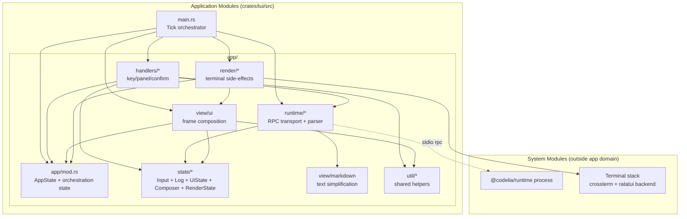
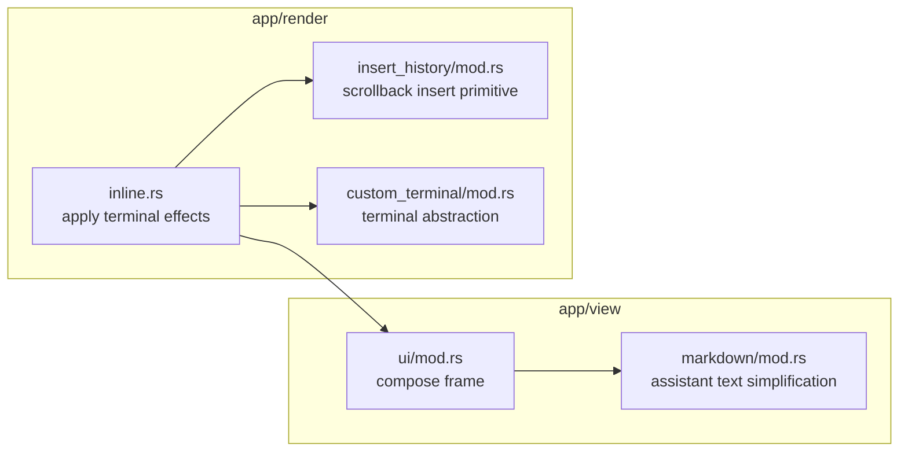
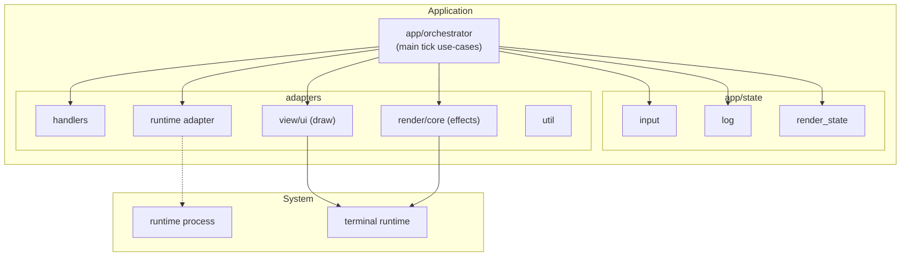

# TUI Architecture Spec

This document defines the module boundaries for `crates/tui` and clarifies the responsibility split raised in review:

- where view-related state should live
- what `state/log` means
- how `view/ui` and rendering core differ
- how to separate application modules from system modules

Status labels used in this document:

- `Implemented`: matches current code
- `Planned`: target for next refactor phase

## 1. Current architecture (`Implemented`)

### 1.1 Responsibility map

- `src/main.rs`
  - Tick loop orchestration: runtime input, keyboard/mouse input, redraw scheduling, mode transitions.
- `src/app/mod.rs`
  - Shared application state root (`AppState`) and orchestration-facing state.
- `src/app/state/`
  - Domain/UI state for text/log and UI/render state buckets.
  - Includes `input`, `log`, `ui/*` (component state modules + composer suggestion/completion), and `render`.
- `src/app/handlers/`
  - Key-driven operation branching and panel/confirm transitions.
- `src/app/runtime/`
  - Runtime boundary adapter (`spawn/send_*`) and runtime output parser.
- `src/app/view/`
  - `ui`: frame composition and UI component modules (`input`, `log`, `status`, `layout`, `panels/*`).
  - `markdown`: assistant markdown simplification.
- `src/app/render/`
  - terminal-facing rendering core / side-effects.
  - `inline`: scrollback insertion and cursor side-effects.
  - `custom_terminal` / `insert_history`: terminal primitives.
- `src/app/util/`
  - Text sanitize/wrap helpers, attachment helpers, clipboard ingestion.

### 1.2 System vs Application boundary

### 1.3 `view/ui` vs rendering core (`Implemented`)

`view` and `render` are separated by module root:

- `view/ui`
  - Computes wrapped/visible lines and draws widgets onto frame.
  - Owns panel projection logic from state to display lines.
- `state/ui/composer`
  - Owns slash-command / `$skill` suggestion rows, completion logic, and unknown-command hint generation.
  - Shared by both `handlers` (input action) and `view` (suggestion panel projection).
- `render/inline`
  - Applies terminal side-effects after draw (history insertion, cursor visibility/sync).

### 1.4 About render state location (`Implemented`)

Render-related runtime state is currently in `app/state/render.rs`:

- `RenderState`
- `WrappedLogCache`
- `PerfDebugStats`

Rationale: these are shared across the tick stages (`reduce -> draw -> side-effects`) and consumed by both main loop and view modules, but are now owned by the state layer.

## 2. Next refactor target (`Planned`)

### 2.1 Planned naming and ownership cleanup

- `state/log` is a log-domain model, not MVC "Model".
- Next step is orchestrator split:
  - extract tick/reducer orchestration from `main.rs` into `app/orchestrator/*`
  - keep `view/*` for app UI composition and `render/*` for terminal side-effects

### 2.2 Planned module shape

## 3. Rules for future changes

- New feature state must be categorized before implementation:
  - domain state (`app/state/*`)
  - UI state (`app/state/ui/*`) and render runtime state (`app/state/render.rs`)
  - orchestration-only ephemeral state (`app/orchestrator`, planned)
- `view/*` must not depend on `handlers/*`; shared pure logic should live under `state/*` or `util/*`.
- `view/ui` must not own terminal side-effects.
- Terminal side-effects must stay in rendering core path (`render/*`).
- External process/terminal APIs remain system modules and are accessed through adapters.
