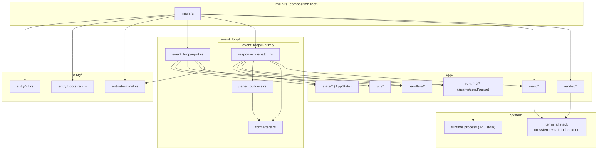
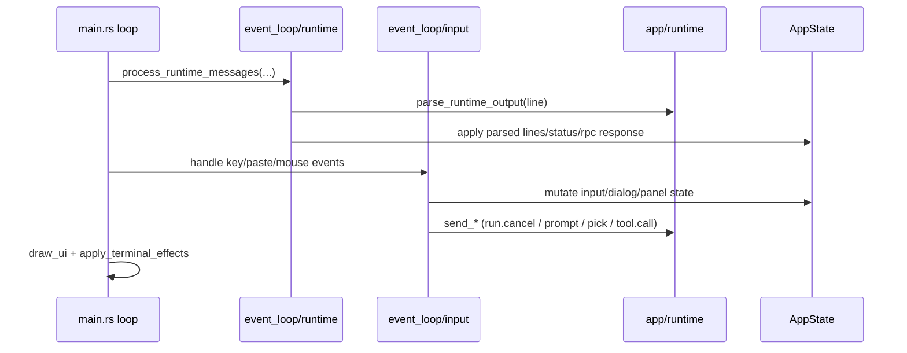
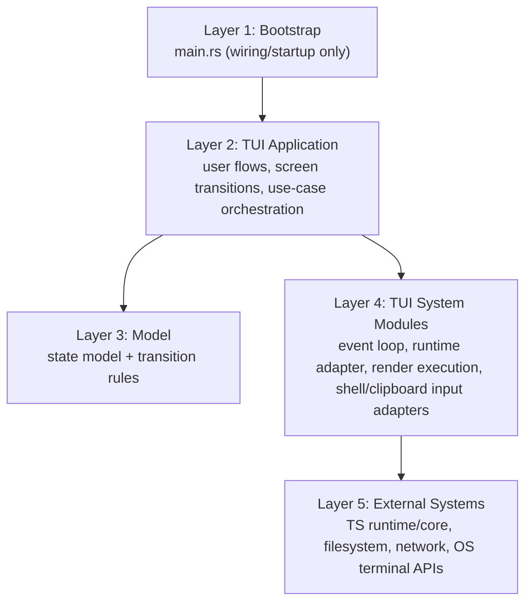

# TUI Architecture Spec

This document defines current module boundaries for `crates/tui` and provides a concrete architecture diagram for design discussion.

Status labels used in this document:

- `Implemented`: verified in current code
- `Partial`: partially achieved, with known layering leaks
- `Planned`: target state for future refactor

## 1. Current Architecture (`Implemented`)

Baseline date: **March 3, 2026**.

### 1.1 Responsibility map

- `src/main.rs`
  - Composition root for startup + tick loop orchestration.
  - Wires `entry/*`, `event_loop/*`, `app/view`, and `app/render`.
- `src/entry/`
  - `cli.rs`: CLI parse/help/version + debug/diagnostics flag resolution.
  - `bootstrap.rs`: startup banner + initial model/session bootstrap requests.
  - `terminal.rs`: terminal lifecycle (raw mode, keyboard flags, cursor restore).
- `src/event_loop/`
  - `input.rs`: key/paste/mouse routing and dialog/panel key handling.
  - `runtime/response_dispatch.rs`: parsed runtime output application + RPC response state transitions.
  - `runtime/panel_builders.rs`: panel row/state builders.
  - `runtime/formatters.rs`: runtime/error/status formatting helpers.
- `src/app/`
  - `state/*`: `AppState` and state buckets.
  - `handlers/*`: command/confirm/panel domain handlers.
  - `runtime/*`: runtime process adapter + parser + send APIs.
  - `view/*`: frame composition and markdown rendering.
  - `render/*`: terminal side-effects and inline scrollback insertion.
  - `util/*`: shared helpers (text/attachments/clipboard).

### 1.2 Current module diagram

```mermaid
flowchart TD
  subgraph main_layer["main.rs (composition root)"]
    main["main.rs"]
  end

  subgraph entry_layer["entry/"]
    cli["entry/cli.rs"]
    bootstrap["entry/bootstrap.rs"]
    terminal["entry/terminal.rs"]
  end

  subgraph loop_layer["event_loop/"]
    input["event_loop/input.rs"]
    subgraph runtime_sub["event_loop/runtime/"]
      dispatch["response_dispatch.rs"]
      panels["panel_builders.rs"]
      formatters["formatters.rs"]
    end
  end

  subgraph app_layer["app/"]
    state["state/* (AppState)"]
    handlers["handlers/*"]
    runtime_adapter["runtime/* (spawn/send/parse)"]
    view["view/*"]
    render["render/*"]
    util["util/*"]
  end

  subgraph system_layer["System"]
    runtime_proc["runtime process (IPC stdio)"]
    term_stack["terminal stack\ncrossterm + ratatui backend"]
  end

  main --> cli
  main --> bootstrap
  main --> terminal
  main --> input
  main --> dispatch
  main --> view
  main --> render

  input --> state
  input --> handlers
  input --> runtime_adapter
  input --> util
  input --> terminal

  dispatch --> state
  dispatch --> handlers
  dispatch --> runtime_adapter
  dispatch --> panels
  dispatch --> formatters
  dispatch --> view

  panels --> formatters

  runtime_adapter --> runtime_proc
  render --> term_stack
  view --> term_stack
```

### 1.3 Runtime tick flow (current)

```mermaid
sequenceDiagram
  participant Main as main.rs loop
  participant ER as event_loop/runtime
  participant EI as event_loop/input
  participant AR as app/runtime
  participant S as AppState

  Main->>ER: process_runtime_messages(...)
  ER->>AR: parse_runtime_output(line)
  ER->>S: apply parsed lines/status/rpc response

  Main->>EI: handle key/paste/mouse events
  EI->>S: mutate input/dialog/panel state
  EI->>AR: send_* (run.cancel / prompt / pick / tool.call)

  Main->>Main: draw_ui + apply_terminal_effects
```

## 2. Layered Architecture Direction (`Planned`)

This project uses a practical **layered architecture** discussion model:

- Layer order is for dependency control, not "importance ranking".
- User-facing value starts in the UI/Application layer.
- Business and UI requirements are expected to change continuously.
- The key rule is still one-way dependency: higher layers may depend on lower layers, not vice versa.

### 2.1 Target layer stack

```mermaid
flowchart TD
  L1["Layer 1: Bootstrap\nmain.rs (wiring/startup only)"]
  L2["Layer 2: TUI Application\nuser flows, screen transitions, use-case orchestration"]
  L3["Layer 3: Model\nstate model + transition rules"]
  L4["Layer 4: TUI System Modules\nevent loop, runtime adapter, render execution, shell/clipboard input adapters"]
  L5["Layer 5: External Systems\nTS runtime/core, filesystem, network, OS terminal APIs"]

  L1 --> L2
  L2 --> L3
  L2 --> L4
  L4 --> L5
```

### 2.2 Current mapping (as-is -> target layer)

- Layer 1 (Bootstrap)
  - `src/main.rs`
- Layer 2 (TUI Application)
  - `src/entry/*`
  - `src/event_loop/input.rs`
  - parts of `src/event_loop/runtime/response_dispatch.rs` (mixed today)
  - `src/app/handlers/*`
- Layer 3 (Model)
  - `src/app/state/*`
  - `src/app/mod.rs` (state root, currently mixed with orchestration helpers)
- Layer 4 (TUI System Modules)
  - `src/event_loop/runtime/*` (dispatch/parser coupling, partially mixed)
  - `src/app/runtime/*`
  - `src/app/render/*`
  - `src/app/view/*` (render adapter side, not pure model)
  - `src/app/util/clipboard/*` and shell/attachment IO-adjacent helpers
- Layer 5 (External Systems)
  - runtime subprocess (TS runtime/core via IPC)
  - terminal backend (`crossterm`/`ratatui`)
  - OS filesystem/network/clipboard APIs

## 3. Current Gaps Against Layered Target (`Partial`)

- `event_loop/runtime/response_dispatch.rs` is still a mixed layer
  - dispatch routing
  - use-case transitions
  - model mutations
  - presentation-adjacent formatting hooks
- `app/state` is correctly central, but write paths are broad (many modules mutate `AppState` directly).
- `view` and runtime response handling still have some cross-concern coupling paths.

## 4. Refactor Steps For Layered Shape (`Planned`)

1. Split `response_dispatch.rs` into domain slices (`run/session/model/lane/mcp/skills/context/auth`).
2. Keep a thin top-level dispatcher whose only role is request-id/result routing.
3. Define explicit model-transition entrypoints (reduce direct free-form `AppState` mutation paths).
4. Separate "panel state assembly" from response dispatch execution flow.
5. Keep adapters (`runtime`, terminal, clipboard, shell input) in the system-modules layer with clear boundaries.

## 5. Discussion Questions

1. Which files should be canonical Layer 2 (Application) boundaries?
2. Do we want `AppState` mutation mediated through explicit transition functions only?
3. Should `view` be split into pure projection vs terminal adapter modules?
