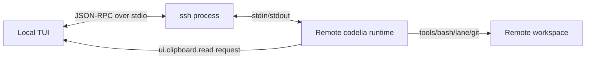

# TUI Remote Runtime over SSH Spec

Status: `Planned` (2026-02-15)

This document defines how `crates/tui` can connect to a runtime running on a
remote host over SSH while keeping the UI local.

---

## 0. Motivation

Current TUI behavior spawns runtime as a local child process and communicates
via stdio JSON-RPC.

- Current runtime spawn point: `crates/tui/src/app/runtime/client.rs`
- Current runtime usage from main loop: `crates/tui/src/main.rs`

For VSCode Remote-SSH-like usage, we need:

1. local TUI rendering/input
2. remote runtime execution (tools/git/worktree/lane run on remote host)
3. secure and resilient transport
4. explicit brokering for local-only resources (clipboard)

---

## 1. Scope / Non-scope

### In scope

- Add an SSH-backed runtime transport for TUI.
- Keep the existing JSON-RPC protocol and event model.
- Define capability + request flow for runtime-initiated local clipboard read.
- Define connection lifecycle (connect/disconnect/reconnect) and safety policy.

### Out of scope (phase 1)

- Port forwarding for arbitrary services.
- Full remote file browser/mount UX in TUI.
- Replacing runtime permissions policy.
- Background daemon manager (`codeliad`) on remote host.

---

## 2. Design Principles

1. Runtime remains the execution boundary.
2. TUI remains the UI boundary.
3. Local resources are never read directly by remote runtime.
4. Runtime-to-UI requests are the only bridge for local resources.
5. SSH transport must preserve existing stdio JSON-RPC semantics.

---

## 3. Architecture

### 3.1 Logical model



### 3.2 Transport abstraction in TUI

TUI should not assume runtime is always a local `ChildStdin`/`Child` pair.
Introduce a transport adapter with two implementations:

- `local_process` (existing behavior)
- `ssh_process` (`ssh -T ... <remote-runtime-cmd>`)

Proposed conceptual interface:

```ts
interface RuntimeTransport {
  sendJsonLine(line: string): Promise<void>;
  recv(): AsyncIterable<string>; // NDJSON lines from runtime stdout/stderr tags
  shutdown(): Promise<void>;
  status(): "connecting" | "ready" | "disconnected";
}
```

Rust implementation can use trait/object or enum-based dispatch.

### 3.3 Runtime location modes

- `local` (default): current behavior.
- `ssh`: runtime command executed on remote host via SSH.

Mode is selected by CLI options and/or env (see section 6).

---

## 4. SSH Execution Contract

### 4.1 Command model

TUI launches a local `ssh` client process and communicates only through the
process stdin/stdout.

Recommended SSH command characteristics:

- disable pseudo-tty (`-T`) because protocol is machine I/O
- non-interactive auth (`BatchMode=yes`)
- explicit host key policy (`StrictHostKeyChecking=yes` by default)
- keepalive enabled (`ServerAliveInterval`, `ServerAliveCountMax`)

Example shape (illustrative):

```bash
ssh -T \
  -o BatchMode=yes \
  -o ServerAliveInterval=15 \
  -o ServerAliveCountMax=3 \
  <host> -- <remote-runtime-cmd> <remote-runtime-args...>
```

### 4.2 Remote runtime command

Runtime command must be deterministic and non-interactive.

Examples:

- `bun /path/to/packages/runtime/src/index.ts`
- installed runtime binary entrypoint (future)

### 4.3 Working directory

Remote runtime working directory must be explicit.

- Prefer SSH command wrapper that executes `cd <remote-cwd> && <runtime-cmd>`.
- Runtime should report the effective working directory via existing
  `context.inspect.runtime_working_dir`.

### 4.4 Failure handling

Connection is considered failed when:

- SSH exits non-zero during startup.
- JSON-RPC initialize handshake times out.
- runtime process exits unexpectedly after connected state.

TUI behavior:

- show transport-level status/error in log
- stop accepting run submission until reconnect
- keep unsent composer state intact

---

## 5. Local Clipboard Broker (Runtime -> UI Request)

When runtime runs remotely, clipboard access to the local machine must be
brokered by UI.

### 5.1 Capability extension

Add UI capability:

```ts
supports_clipboard_read?: boolean;
```

- Sent by UI in `initialize.ui_capabilities`.
- If false/missing, runtime must not issue clipboard-read requests.

### 5.2 New Runtime -> UI request

Add method:

- `ui.clipboard.read`

Params proposal:

```ts
export type UiClipboardReadRequestParams = {
  run_id?: string;
  purpose: "image_attachment" | "text_paste";
  formats: Array<"image/png" | "text/plain">;
  max_bytes?: number;
  prompt?: string; // user-visible reason, short
};
```

Result proposal:

```ts
export type UiClipboardReadResult = {
  ok: boolean;
  cancelled?: boolean;
  items?: Array<
    | {
        type: "image";
        media_type: "image/png";
        data_url: string;
        width?: number;
        height?: number;
        bytes: number;
      }
    | {
        type: "text";
        text: string;
        bytes: number;
      }
  >;
  error?: string;
};
```

### 5.3 Permission policy for clipboard read

Clipboard read is privacy-sensitive.

- Runtime should request explicit UI confirmation before read, unless user has
  remembered allow policy for the same action class.
- Deny/cancel must return structured failure to runtime and remain non-fatal to
  the overall run.

### 5.4 Existing TUI clipboard implementation reuse

Current local clipboard ingestion logic in `crates/tui/src/app/util/clipboard`
remains the source for actual read/encoding.

- On WSL, existing Windows fallback path remains valid.
- Remote runtime never runs local clipboard commands directly.

---

## 6. Configuration Surface (Proposed)

### 6.1 CLI options

```text
--runtime-transport <local|ssh>
--runtime-ssh-host <host-or-alias>
--runtime-ssh-opts "<ssh options string>"
--runtime-remote-cmd "<command>"
--runtime-remote-cwd "<path>"
```

### 6.2 Environment variables

```text
CODELIA_RUNTIME_TRANSPORT=local|ssh
CODELIA_RUNTIME_SSH_HOST=...
CODELIA_RUNTIME_SSH_OPTS=...
CODELIA_RUNTIME_REMOTE_CMD=...
CODELIA_RUNTIME_REMOTE_CWD=...
```

Precedence: CLI options > env > defaults.

### 6.3 Compatibility with existing envs

Existing local runtime controls remain valid:

- `CODELIA_RUNTIME_CMD`
- `CODELIA_RUNTIME_ARGS`

They apply only in `local` transport mode.

---

## 7. Protocol/Package Changes (Planned)

### 7.1 `packages/protocol`

- Add `supports_clipboard_read` to `UiCapabilities`.
- Add `ui.clipboard.read` to `ProtocolMethod`.
- Add `UiClipboardReadRequestParams` / `UiClipboardReadResult` types.

### 7.2 `docs/specs/ui-protocol.md`

- Extend capabilities section with clipboard capability.
- Add a new Runtime -> UI request subsection for `ui.clipboard.read`.

### 7.3 `packages/runtime`

- Add a UI-request helper for clipboard read.
- Gate request usage by initialize capability.
- Return actionable error when unsupported/unavailable.

### 7.4 `crates/tui`

- Replace fixed runtime child wiring with transport abstraction.
- Implement SSH transport adapter.
- Handle `ui.clipboard.read` in runtime message handling path.

---

## 8. Security Model

1. Trust boundary:
   - local UI is trusted for local resource access.
   - remote runtime is trusted for workspace/tool execution only.
2. Clipboard is treated as sensitive local data.
3. SSH command construction must avoid shell interpolation vulnerabilities.
4. Host key verification must be strict by default.
5. Runtime must not silently fall back to insecure clipboard extraction paths.

---

## 9. Rollout Plan

### Phase 1

- Transport abstraction in TUI.
- SSH transport MVP (`ssh -T` + initialize handshake).
- Basic reconnect command/manual restart.

### Phase 2

- Clipboard broker protocol and runtime integration.
- UI confirmation affordance for clipboard reads.
- Capability-based fallback behavior.

### Phase 3

- Connection UX polish (status indicator, retries, clearer diagnostics).
- Optional persistent SSH control connection optimization.

---

## 10. Acceptance Criteria

1. TUI can run with `--runtime-transport ssh` and complete `initialize`.
2. `run.start` and `agent.event` flows work unchanged over SSH transport.
3. Tool execution happens on remote host (verified by runtime context/status).
4. Clipboard read requested by remote runtime is served by local UI through
   `ui.clipboard.read` and never by remote shell execution.
5. If clipboard capability is unavailable, runtime returns explicit unsupported
   error without crashing the run loop.
6. Local transport remains backward compatible.

---

## 11. Open Questions

1. Should SSH bootstrap/install of runtime be in scope for phase 1 or separate?
2. Should reconnect auto-retry be default or opt-in?
3. Do we need a dedicated `ui.resource.read` generic request instead of a
   clipboard-specific request in phase 1?

---

## 12. References

- `docs/specs/ui-protocol.md`
- `docs/specs/tui-architecture.md`
- `docs/specs/tui-clipboard-image-paste.md`
- `docs/specs/lane-multiplexer.md`
- `crates/tui/src/app/runtime/client.rs`
- `crates/tui/src/app/util/clipboard/mod.rs`
